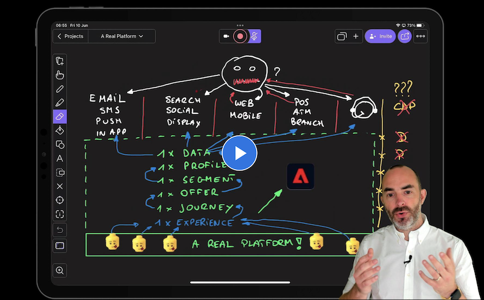

# AEP Quick-Start Guide and Tutorial for Solution Partners

## Overview

This tutorial is the perfect starting point for Data Engineers, Data Analysts, Data Architects, Data Scientists, Orchestration Engineers and Marketers to gain a full understanding of the business value of Adobe Experience Platform and all of its application services. Each lesson focuses on a real challenge businesses face in today's complex ecosystem of personalization and breaks down how Experience Platform solves that challenge in various hands-on exercises. Have a look at this video to understand the problems Adobe Experience Platform will help you solve.

>](https://video.tv.adobe.com/v/344237?quality=12&enable=on)

This tutorial offers clear insights in the following applications:

* Adobe Experience Platform
* Adobe Experience Platform Data Collection
* Real-time CDP

After completing this tutorial, you will be able to:

* Configure an Adobe Experience Platform Data Collection property and setup the new Web SDK extension in Adobe Experience Platform Data Collection
* Stream data into Adobe Experience Platform in real-time using Adobe Experience Platform Data Collection

## Prerequisites

* Access to Adobe Experience Platform: [https://experience.adobe.com/platform](https://experience.adobe.com/platform)
* Access to Adobe Experience Platform Data Collection: [https://experience.adobe.com/#/data-collection/](https://experience.adobe.com/#/data-collection/)
* Access to Demo System: [https://dashboard.adobedemo.com/](https://dashboard.adobedemo.com/)


This tutorial was created to facilitate a particular workshop format. It uses specific systems and accounts to which you might not have access. Even without access, we think you can still learn a lot by reading through this very detailed content. If you're a participant in one of the workshops and need your access credentials, please contact **spphelp@adobe.com**, who will provide you with the required information.


## About this tutorial

In these lessons, you will implement Adobe Experience Platform and Application Services using a demo website which supports multiple industries. The demo website and mobile app have a rich data layer and functionality that will allow you to build a realistic implementation. It provides access to demo brands such as **Luma**, **Citi Signal**, **EXP News**, **MUTUAL365**, **Carvelo** and several others. You will build your own Adobe Experience Platform Data Collection Client property, in your Experience Cloud organization, and map it to your demo website. This will then generate data that is sent into your own Adobe Experience Platform instance.

## Architecture

Before you start with the hands-on exercises, have a look at the Architecture behind this tutorial. As you can see in the above Overview, this tutorial will go deep on a number of features and functionalities of Adobe Experience Platform, but will also discuss multiple integrations across a variety of Sources and Destinations. In order for you to properly understand the architecture behind this tutorial and the overall positioning of Adobe Experience Platform into your Enterprise ecosystem, start by reviewing the architecture video and diagram.

Go to [Architecture](overview/architecture.md).

## Videos

You can find a lot of interesting videos from our Tech Academy events, from Bootcamps and more on our [Experience Makers Community YouTube channel](https://www.youtube.com/channel/UCUKG2dkZ9pYuZUPebQ21jUw).

Several videos have been created that showcase elements of the enablement and powerful integrations between Adobe Experience Platform and non-Adobe applications. Click the below link to find an overview of those videos.

Go to [Videos](overview/videos.md).

## Content

[0. Getting started](getting-started.md)

* **Audience:** All participants of the Comprehensive Technical Tutorial for Adobe Experience Platform
* **Prerequisites:** Access to Demo System Next, Adobe Experience Platform and Adobe Experience Platform Data Collection. Access to the default Configuration ID of your Adobe Experience Platform environment.
* **Description:** In this foundational module, you will setup everything so that you can access and use the demo environment.
* **Time Investment:** 30 minutes


Thank you for investing your time in learning all there is to know about Adobe Experience Platform. If you have questions, want to share general feedback of have suggestions on future content, please contact the Solution Partner Portal, by sending an email to **spphelp@adobe.com**.

