# Comprehensive Technical Tutorial for Adobe Experience Platform - How is Completion Measured?

You can update your completion of the Comprehensive Technical Tutorial for Adobe Experience Platform using the Chrome extension that was created. 

After following the instructions in Module 0, you entered your organization's **Configuration ID** in the Chrome extension and you signed up. Your Chrome extension should now look like this. Click the purple icon to submit completion of a module.

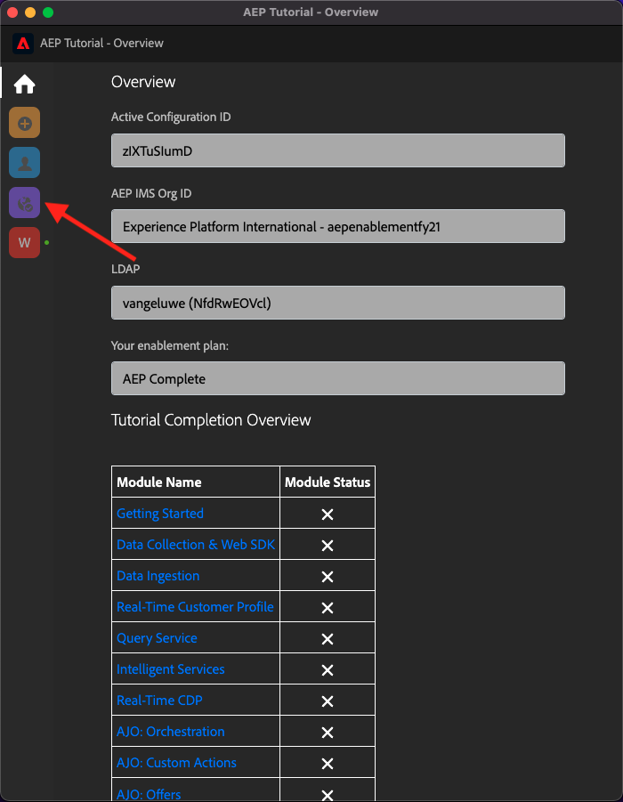

You'll then see this:

By opening the dropdown menu, you can select which module you want to complete: 

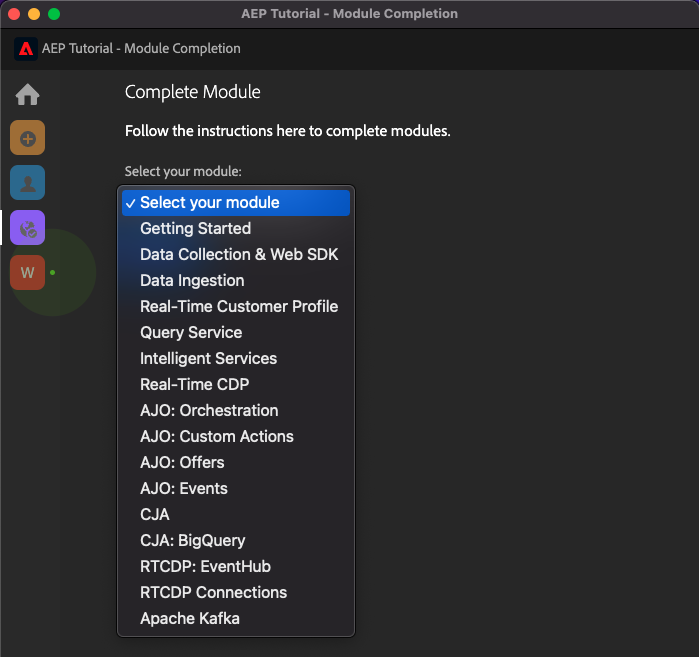

To complete a module, you're expected to provide a proof of completion.

Below are the expected proofs of completion for every module.

## Getting Started

The expected proof of completion for module **Getting Started** is the ID of the Demo System project for web that you created.

The ID of the Demo System project for web format looks like this: `--demoProfileLdap-- - OCUC`.

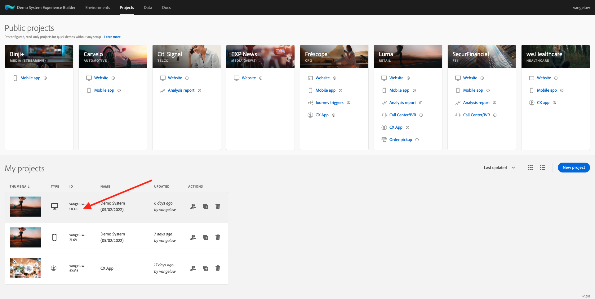

Select **Getting Started** in the dropdown menu, enter your **ID of the Demo System project** and click the **Submit** - button.

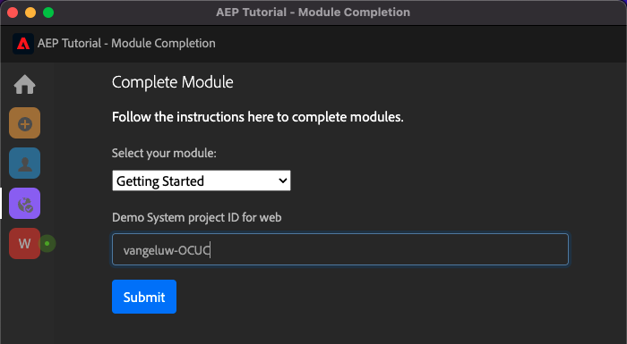

## Data Collection & Web SDK

The expected proof of completion for module **Data Collection & Web SDK** is the name of the Data Collection property for web.

The name of the Data Collection property for web format looks like this: `--demoProfileLdap-- - Demo System (05/02/2022) (enablement) 1644046719474`.

Select **Data Collection & Web SDK** in the dropdown menu, enter your **Data Collection property name for web** and click the **Submit** - button.

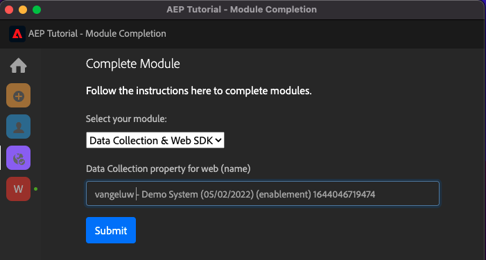

## Data Ingestion

The expected proof of completion for module **Data Ingestion** is the Dataset ID for the 2 datasets that you created.

The Dataset ID format looks like this: **5f069724723ef41916a8b5d2**.

`--demoProfileLdap-- - Demo System - Event Dataset for Website`

`--demoProfileLdap-- - Demo System - Profile Dataset for Website`

Select **Data Ingestion** in the dropdown menu, enter your **Dataset ID** for both datasets in the input fields and click the **Submit** - button.

## Real-Time Customer Profile

The expected proof of completion for module **Real-Time Customer Profile** is the **Segment ID** of the segment that you created through the UI, `--demoProfileLdap-- - Male customers with interest in Montana Wind Jacket`.

The Segment ID format looks like this: **8cb7034d-d4ae-4d26-a61f-a76559c12457**.

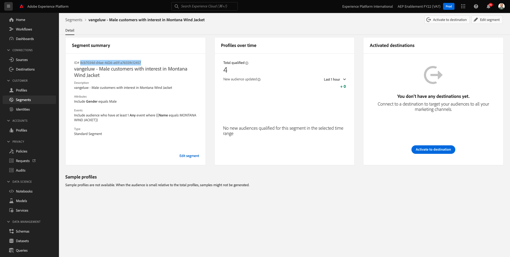

Select **Real-Time Customer Profile** in the dropdown menu, enter your **Segment ID** in the input field and click the **Submit** - button.

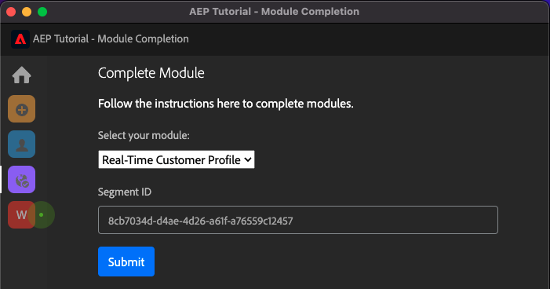

## Query Service

The expected proof of completion for module **Query Service** is the Dataset ID for your `--demoProfileLdap--_callcenter_interaction_analysis` - dataset that you get after completing the module.

The format looks like this: **62076f68f14a9d194995d4e2**.

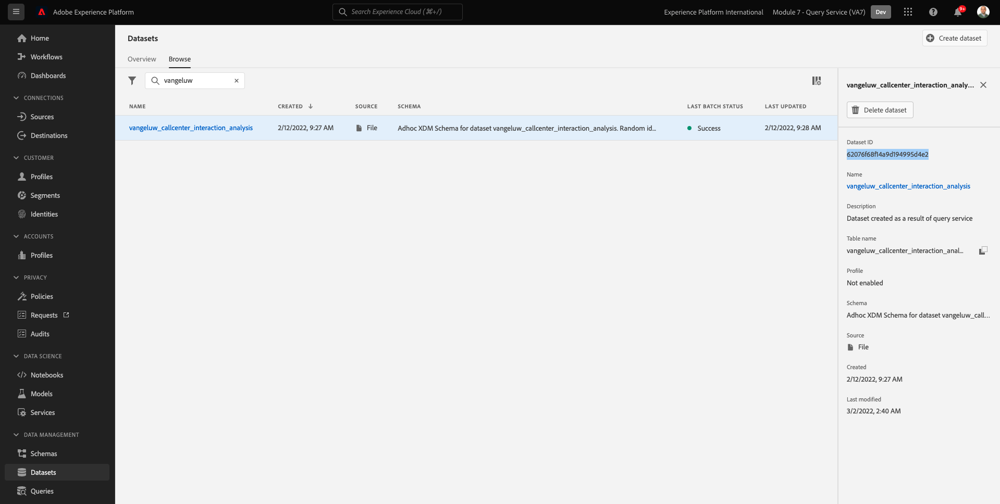

Select **Query Service** in the dropdown menu, enter your **Dataset ID** in the input field and click the **Submit** - button.

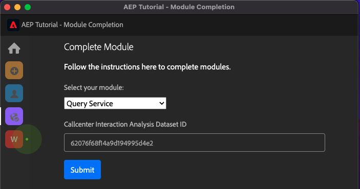

## Intelligent Services

The expected proof of completion for module **Intelligent Services** is the ID for your **Product Purchase Propensity Customer AI Service**.

The format looks like this: **12729** and you can retrieve it from the URL when having opened your service.

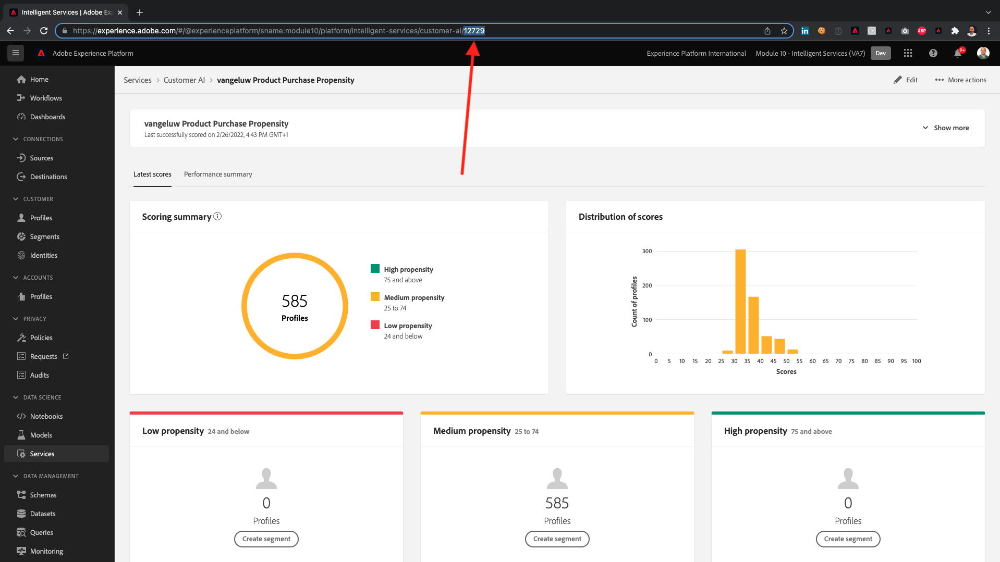

Select **Intelligent Services** in the dropdown menu, enter your **Customer AI Service ID** in the input field and click the **Submit** - button.

## Real-Time CDP

The expected proof of completion for module **Real-Time CDP** is the ID of your **Adobe Target Activity**.

The format looks like this: **111804**.

Select **Real-Time CDP** in the dropdown menu, enter your **Adobe Target Activity ID** in the input field and click the **Submit** - button.

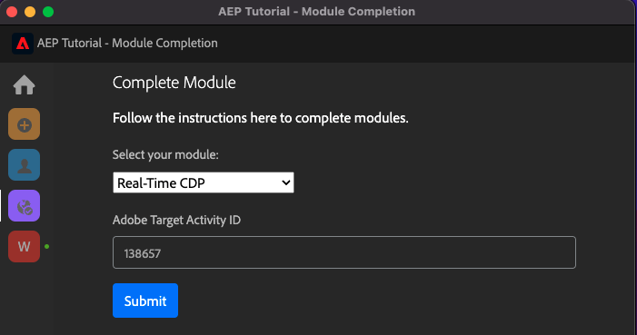

## AJO: Orchestration

The expected proof of completion for module **AJO: Orchestration** is the eventID for your `--demoProfileLdap--AccountCreationEvent`.

The format looks like this: **227402c540eb8f8855c6b2333adf6d54d7153d9d7d56fa475a6866081c574736**.

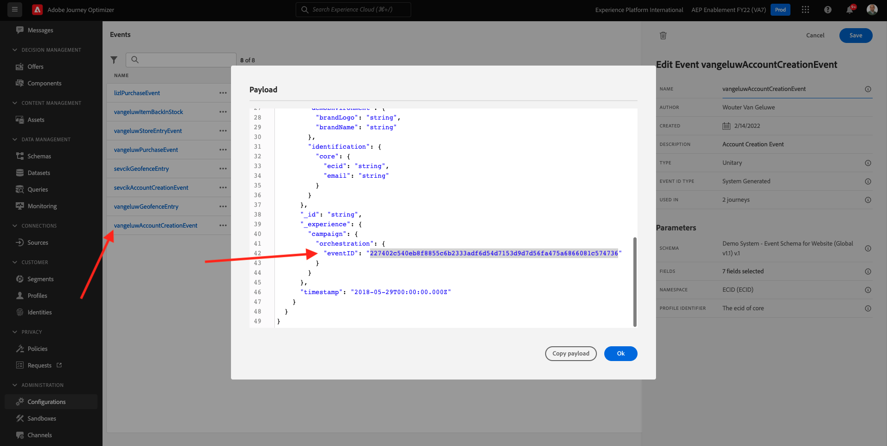

Select **AJO: Orchestration** in the dropdown menu, enter your ** eventID** in the input field and click the **Submit** - button.

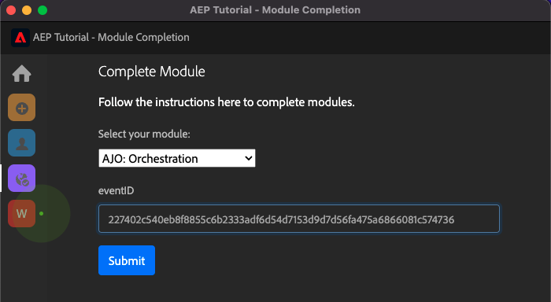

## AJO: Custom Actions

The expected proof of completion for module **AJO: Custom Actions** is the eventID for your event `--demoProfileLdap--GeofenceEntry`.

The format looks like this: **fa42ab7982ba55f039eacec24c1e32e5c51b310c67f0fa559ab49b89b63f4934**.

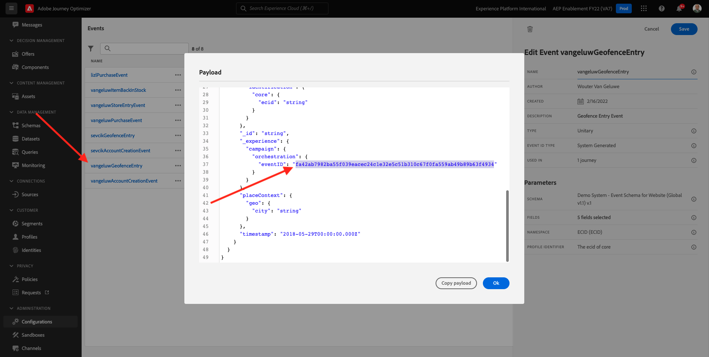

Select **AJO: Custom Actions** in the dropdown menu, enter your **eventID** in the input field and click the **Submit** - button.

## AJO: Offers

The expected proof of completion for module **AJO: Offers** is the ID of the **Offer Decision** that you created.

You can find the **Offer Decision ID**, which looks like this **xcore:offer-activity:1122fcc4603ea499**, here:

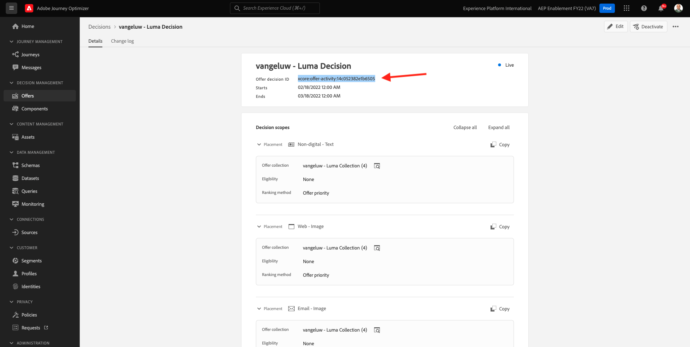

Select **AJO: Offers** in the dropdown menu, enter your **Offer Decision ID** in the input field and click the **Submit** - button.

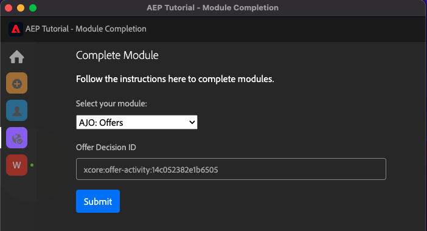

## AJO: Events

The expected proof of completion for module **AJO: Events** is the eventID for your `--demoProfileLdap--StoreEntryEvent`.

The format looks like this: **e3a8f0bdc0b609667cd96a72a6b1e5aafa0ddaf6ccf121c574e6a2030860a633**.

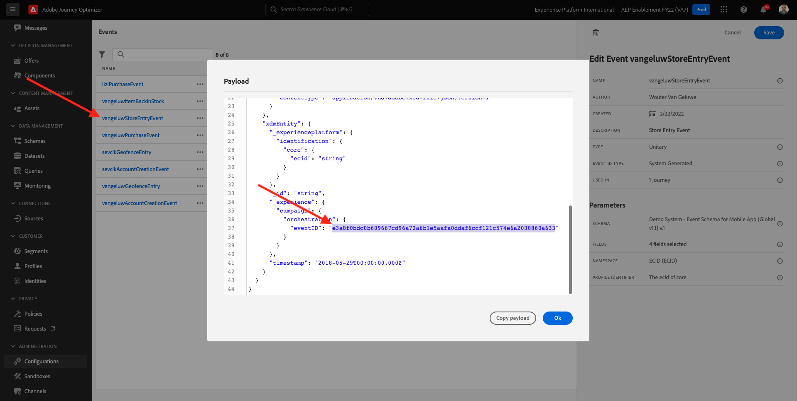

Select **AJO: Events** in the dropdown menu, enter your **eventID** in the input field and click the **Submit** - button.

## CJA

The expected proof of completion for module **CJA** is the ID of your project `--demoProfileLdap-- - Omnichannel Analysis`.

The format looks like this: **6217344f6249ac70c726db60**, you can find it in the URL when you've opened your project.

Select **CJA** in the dropdown menu, enter your **Project ID** in the input field and click the **Submit** - button.

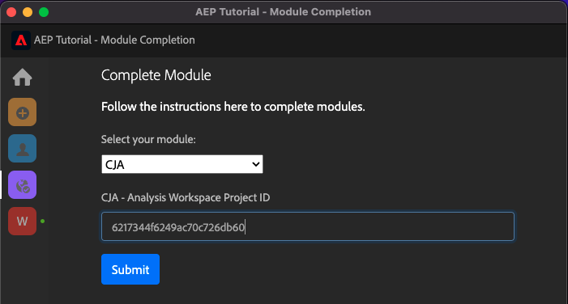

## CJA: BigQuery

The expected proof of completion for module **CJA: BigQuery** is the ID of your **BigQuery**-connection.

You can find the **BigQuery Connection ID**, which looks like this **85a2394d-8b94-410c-a239-4d8b94b10c38**, here:

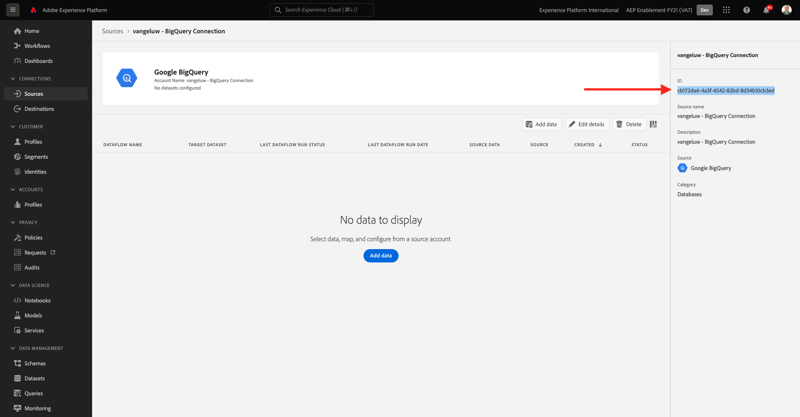

Select **CJA: BigQuery** in the dropdown menu, enter your **BigQuery Connection ID** in the input field and click the **Submit** - button.

## RTCDP: EventHub

The expected proof of completion for module **RTCDP: EventHub** is the ID of your **Microsoft Azure Event Hub** destination in Adobe Experience Platform.

You can find the **Microsoft Azure Event Hub Destination ID**, which looks like this **fa3f7ce5-86fd-4096-bf7c-e586fdc096ba**, here:

Select **RTCDP: EventHub** in the dropdown menu, enter your **Microsoft Azure Event Hub Destination ID** in the input field and click the **Submit** - button.

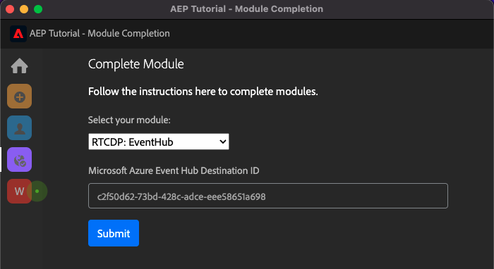

## RTCDP Connections

The expected proof of completion for module **RTCDP Connections** is your **Event Forwarding Property ID**.

You can find the **Event Forwarding Property ID**, which looks like this **PR40f44184c888472e9c19d8d602aab0de**, here:

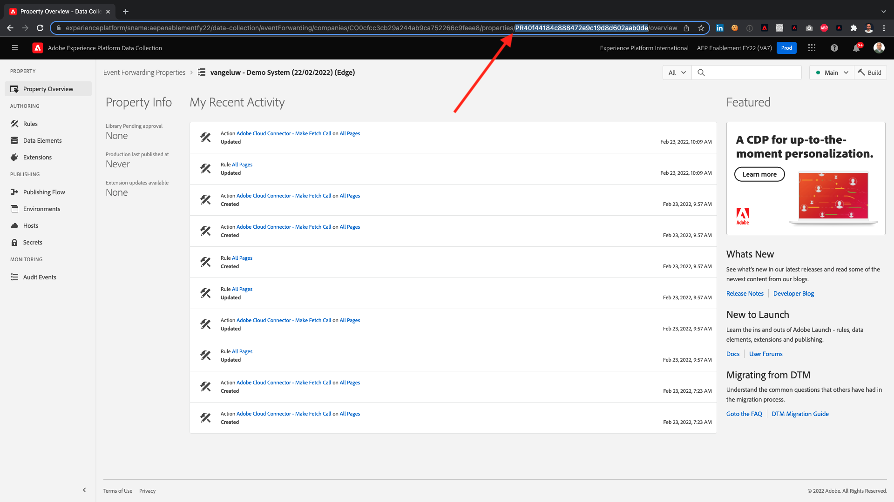

Select **RTCDP Connections** in the dropdown menu, enter your **Event Forwarding Property ID** in the input field and click the **Submit** - button.

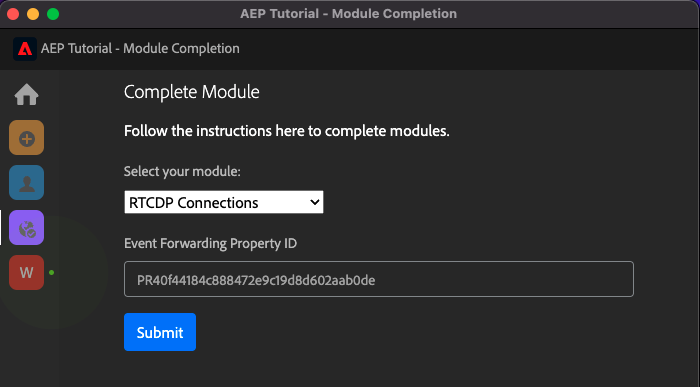

## Apache Kafka

The expected proof of completion for module **Apache Kafka** is the ID of your source connector `--demoProfileLdap-- - Kafka`.

The ID looks like this **f843d50a-ee30-4ca8-a766-0e4f3d29a2f7**, and you can find it here:

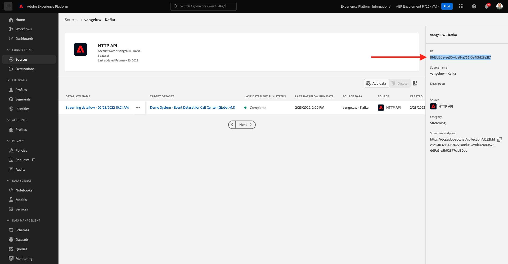

Select **Apache Kafka** in the dropdown menu, enter your **Flow ID** in the input field and click the **Submit** - button.

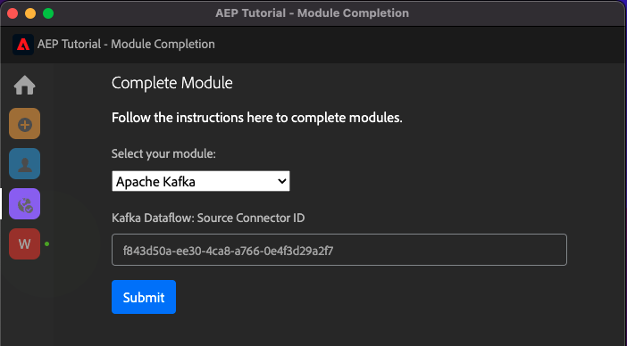
