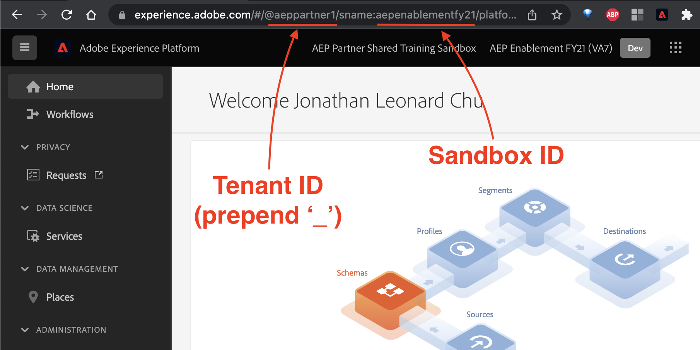

# 0.0 Which environment do I use?


## Previous iterations of this Tutorial referenced a Chrome Extension and Config ID; however, those features are being retired. 
You may still access the documentation [here](../getting-started/ex0a.md).


Throughout this tutorial, you will see the following keys:

| Name     | Key | Explanation |
|:-------------:| :---------------:| :---------------:|
| AEP IMS Org ID         | `--aepImsOrgId--` | Org-specific identifier: alphanumeric string of form xxxxxxxx@AdobeOrg |
| AEP Tenant ID         | `--aepTenantId--` | Org-specific identifier  |
| Sandbox ID | `--aepSandboxId--` | Environment-specific identifier |
| Demo Profile LDAP        | `--demoProfileLdap--` | Your full email address (non-Adobe employees), or text before the @-symbol in your email address (Adobe employees) |

### **Please use the instructions below to get the values for each of these keys, and replace keys with said values as necessary.**

## `--aepImsOrgId--`

An organization (Org ID) is the entity that enables an administrator to configure groups and users, and to control single sign-on in the Experience Cloud.

You can view your organization ID, along with other account information, using a the keyboard shortcut `Ctrl+i` from any page at https://experience.adobe.com to open up the **Data Debugger**.

Under the **'User Information'** tab, you will find the **'Current Org ID'** field, which has the IMS Org ID.

## `--aepTenantId--`

The AEP Tenant ID can be found in the URL: https://experience.adobe.com/#/@xxxx:

For example, the AEP Tenant ID for https://experience.adobe.com/#/@aeppartner1 would be '**_aeppartner1**'


**Please remember to prepend an underscore ('_') before the Tenant ID when using it for AEP purposes.**


## `--aepSandboxId--`

The Sandbox ID is an identifier for the AEP environment a user is working in.

It can be found in the URL after '**sname**': https://experience.adobe.com/#/@aeppartner1/sname:xxxxx

For example, the Sandbox ID for https://experience.adobe.com/#/@aeppartner1/sname:aepenablementyfy21 would be '**aepenablementyfy21**'

## `--demoProfileLdap--`

The LDAP is your full email address (non-Adobe employees), or text before the @-symbol in your email address (Adobe employees)

Adobe Employees: If your email address is **vangeluw@adobe.com**, the LDAP you enter here should be **vangeluw**)


Kindly reach out to your sandbox administrator or **<spphelp@adobe.com>** if you have any difficulties with access


