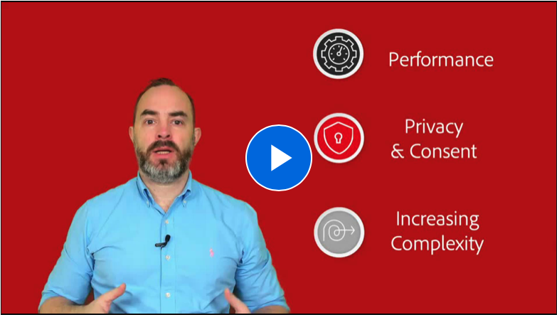
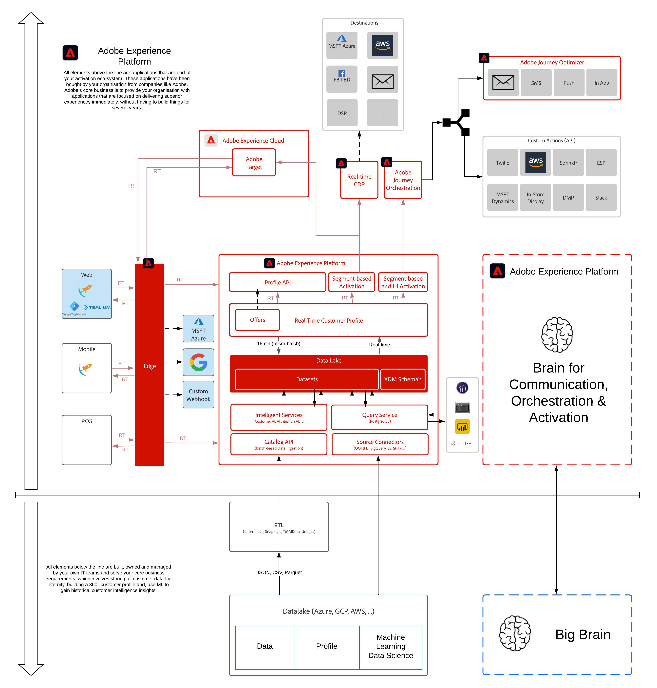

# 14. Real-Time CDP Connections: Event Forwarding

**Author: [Wouter Van Geluwe](https://www.linkedin.com/in/woutervangeluwe/), [Clement Delalande](https://www.linkedin.com/in/clement-delalande/)**

In this module, you'll use the previously configured datasets, schemas and Adobe Experience Platform Data Collection Client property to collect data, and then forward that data server-side to an endpoint of choice.

In this module, you'll:

- Create a Adobe Experience Platform Data Collection Server property
- Install and use the Adobe Cloud Connector extension in Adobe Experience Platform Data Collection
- Create a Google Function endpoint and stream data to it
- Create an AWS endpoint and stream data to it

Watch this video to understand the value, customer journey and configuration process:

>

## Learning Objectives

- Become familiar with Adobe Experience Platform Data Collection Server properties and the new Adobe Cloud Connector extension 
- Understand how to reuse Adobe Experience Platform Web SDK data in 3rd party solutions like Google and AWS
- Understand the architecture behind Adobe Experience Platform Data Collection and Server Side Forwarding.

## Prerequisites

- Access to Adobe Experience Platform and Adobe Experience Platform Data Collection
- Understanding of Adobe Experience Platform datasets and XDM


This tutorial was created to facilitate a particular workshop format. It uses specific systems and accounts to which you might not have access. Even without access, we think you can still learn a lot by reading through this very detailed content. If you're a participant in one of the workshops and need your access credentials, please contact **<spphelp@adobe.com>**, who will provide you with the required information.


## Architecture Overview

Have a look at the below architecture, which highlights the components that will be discussed and used in this module.

## Sandbox to use

For this module, please use this sandbox: `--aepSandboxId--`.

## Exercises

[14.1 Create a Data Collection Event Forwarding property](./ex1.md)

In this exercise, you'll create your Adobe Experience Platform Data Collection Event Forwarding property.

[14.2 Update your Datastream to make data available to your Data Collection Event Forwarding property](./ex2.md)

In this exercise, you'll update your existing Datastream to make data that is collected by your Adobe Experience Platform Data Collection Client property available to your Adobe Experience Platform Data Collection Server property.

[14.3 Create and configure a custom webhook](./ex3.md)

In this exercise, you'll create and configure a custom webhook and you'll start forwarding data that is collected by Web SDK to that custom webhook.

[14.4 Create and configure a Google Cloud Function](./ex4.md)

In this exercise, you'll create and configure a Google Cloud Function and you'll start forwarding data that is collected by Web SDK to Google.

[14.5 Forward events towards the AWS ecosystem](./ex5.md)

In this exercise, you'll configure your AWS environment using AWS API Gateway, AWS Kinesis, AWS Firehose and AWS S3 after which you'll start forwarding event data that is collected by Web SDK.

[Summary and benefits](./summary.md)

Summary of this module and overview of the benefits.


Thank you for investing your time in learning all there is to know about Adobe Experience Platform. If you have questions, want to share general feedback of have suggestions on future content, please contact the Solution Partner Portal, by sending an email to **spphelp@adobe.com**.

