# 2.2 Configure Schemas and Set Identifiers

In this exercise, you'll configure the required XDM schemas to classify profile information and customer behavior. In every XDM schema, you'll also have to configure a primary identifier to link all the information to.
 
## Story

Before you start configuring XDM Schema's and setting Primary Identifiers, we need to think about the business context of what we're trying to do: 

- You want data
- You want to link data to a customer
- You want to build a progressive, Real-time Customer Profile

There are 2 types of data that we want to capture:

- Who is this customer?
- What does this customer do?

However, the question **Who is this customer?** is a very open question that has many answers. When your company wants to see this question answered, you're looking for demographic information like First Name, Last Name and Address. But also for contact information like an Email Address or a Mobile Phone Number. And also for information linked to Language, OptIn/OptOut and maybe even Profile Pictures. And finally, what you really need to know, is how we'll be identifying this customer in the various systems that your company uses.

The same thing goes for the question **What does this customer do?**. It's a very open question with many answers. When your company wants to see this question answered, you're looking for any interaction a customer has has had with any of your online and offline properties. Which pages or products have been visited? Has this customer added a product to his cart or even purchased an item? What device and browser has been used to browse the website? What kind of information is this customer looking for and how can we use that to configure and deliver a delightful experience to this customer? And finally, what we really need to know, is how we'll be identifying this customer in the various systems that your company will use.

## 2.1.1 - Who is this customer

Capturing the answer to **Who is this customer?** for your company is done through the Login/Registration-page.

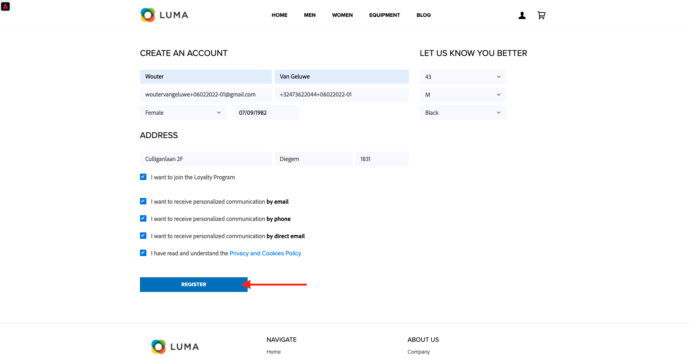

From a Schema perspective, we look at this as a **Class**. The question: **Who is this customer?** is something that we define in the Class **XDM Individual Profile**.

So when you create an XDM Schema to capture the answer to **Who is this customer?**, first of all, you'll need to create and define 1 schema that references the class **XDM Individual Profile**.

To specify what kind of answers can be given to that question, you'll need to define [!UICONTROL Field Groups]. [!UICONTROL Field Groups] are extensions of the Profile-class, and have very specific configurations. For instance, demographic information like First Name, Last Name, Gender and Birthday are part of the Field Group: **Demographic Details**.

Secondly, your company needs to decide how to identify this customer. In the case of your company, the main identifier for a known customer might be a specific customer ID, like for instance an email address. But technically, there are other ways of identifying a customer at your company, like using a mobile phone number.
In this lab, we'll define the email address as the primary identifier and the phone number as a secondary identifier.

Lastly, it's important to distinguish the channel on which data was captured. In this case, we'll be talking about Website Registrations and the schema that needs to be defined needs to reflect **where** the registration data was captured. The channel will also have an important role in influencing what data is captured. As such, it's a best practice to define schema's for every combination of channel, primary identifier and type of data collected.

Based on the above, you'll need to configure a Schema in Adobe Experience Platform.

Log in to Adobe Experience Platform by going to this URL: [https://experience.adobe.com/platform](https://experience.adobe.com/platform).

After logging in, you'll land on the homepage of Adobe Experience Platform.

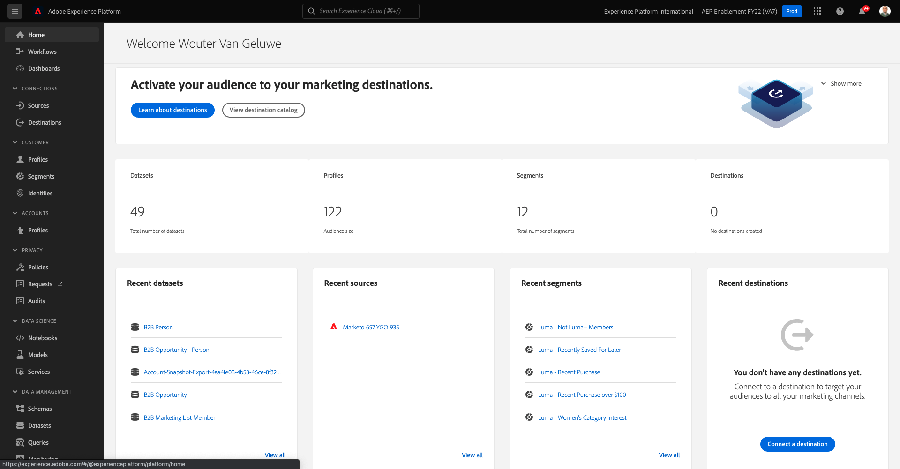

Before you continue, you need to select a **sandbox**. The sandbox to select is named ``--module2sandbox--``. You can do this by clicking the text **Production Prod** in the blue line on top of your screen. After selecting the appropriate sandbox, you'll see the screen change and now you're in your dedicated sandbox.

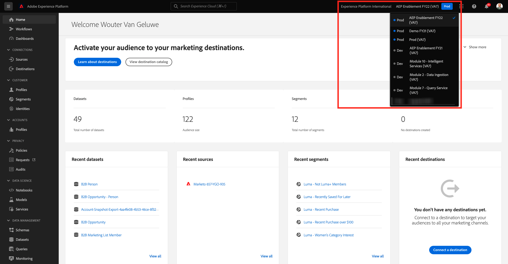

In Adobe Experience Platform, click on **Schemas** in the menu on the left side of your screen. You'll see the list of available Schemas. 

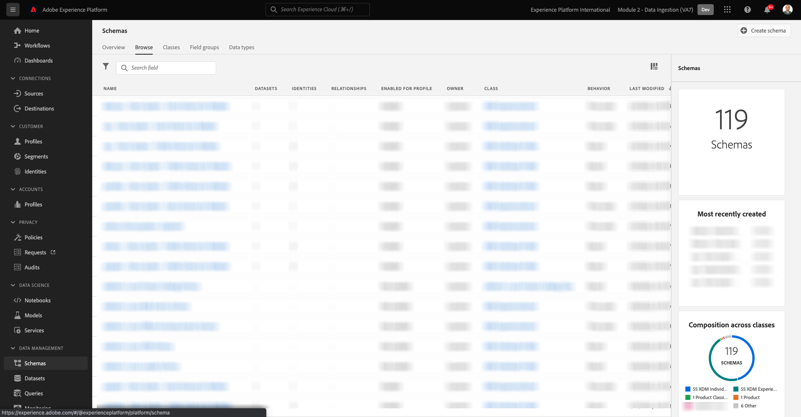

You should create a new schema. To create a new schema, click on the button **+ Create Schema** and select **XDM Individual Profile**.

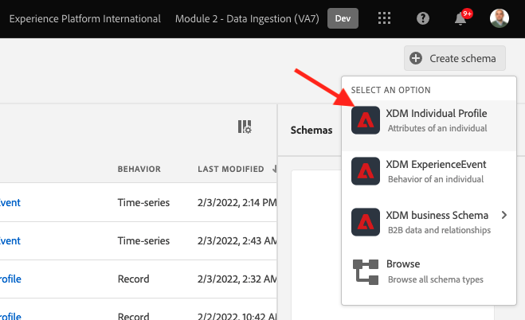

After clicking the **+ Create Schema** button, a new schema is created and you'll be prompted to select or create **field groups**. 

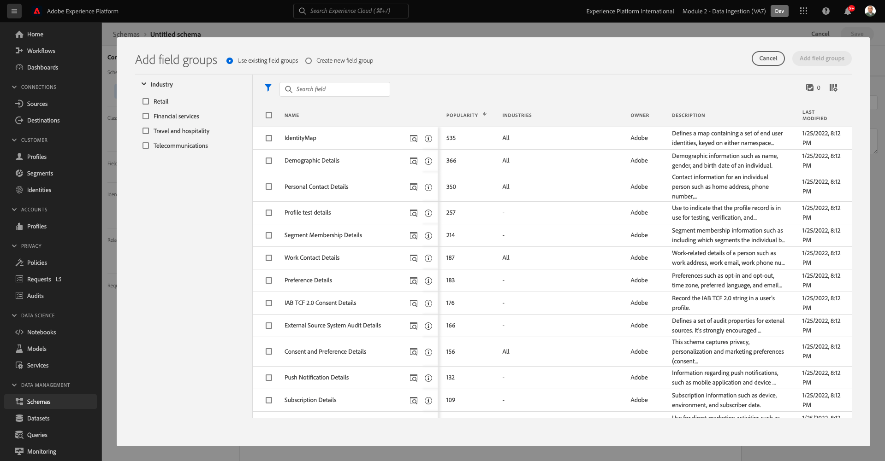

Now you need to define what an answer to the question **Who is this customer?** should look like.
In the introduction of this lab, we noted the need for following attributes to define a customer:

- Demographic information like First Name, Last Name and Address
- Contact information like a Home Address, Email Address or a Mobile Phone Number
- Other Information linked to Language, OptIn/OptOut and maybe even Profile Pictures. 
- Primary Identifier for a customer

To make that information part of your schema, you need to add the following Field Groups to your schema:

- Demographic Details (Demographic Information)
- Personal Contact Details (Contact Information)
- Preference Details (Other Information)
- your company's custom Profile Identification Field Group (Primary and Secondary Identifiers)

In the **Add Field Group** screen, select the Field Group **Demographic Details**, **Personal Contact Details** and **Preference Details**.

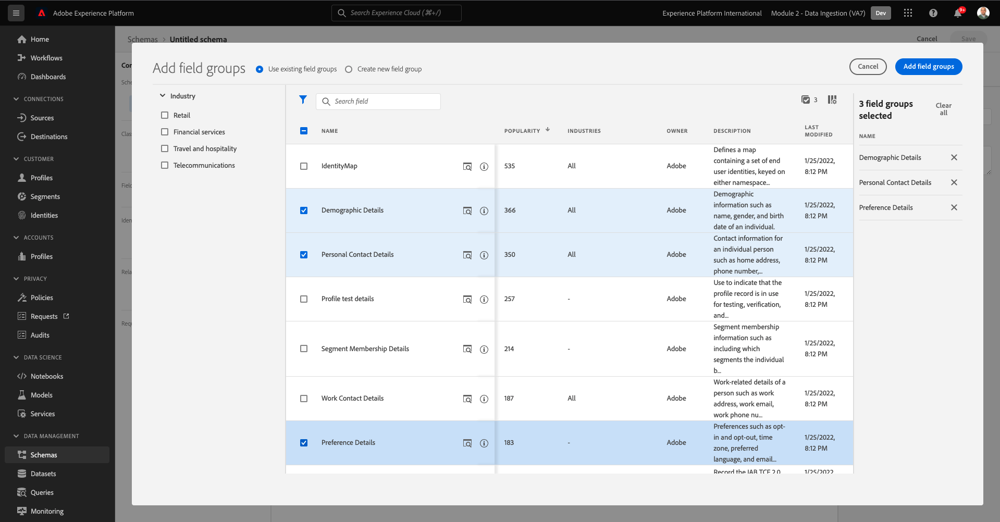

Click the **Add Field Groups** button to add the Field Group to your schema.

You'll now have this:

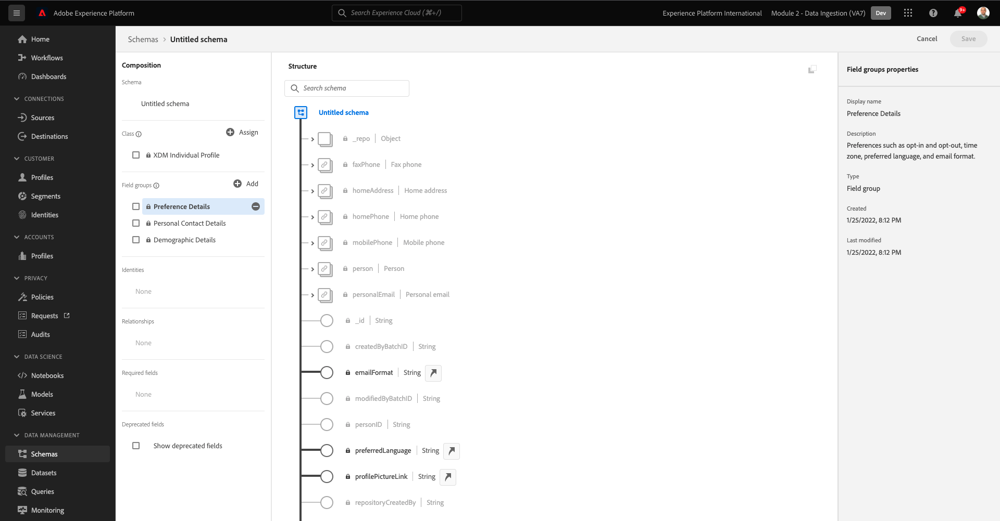

Next, you need a new Field Group to capture the **Identifier** used for data collection. As you've seen in the previous exercise, there's a concept of Primary and Secondary Identifiers. A Primary Identifier is the most important one, as all collected data will be linked to this Identifier.

You will now create your own custom Field Group and as such, you'll be extending the XDM Schema to meet your own company's requirements.

Click the **+ Add** button to start adding a Field Group.

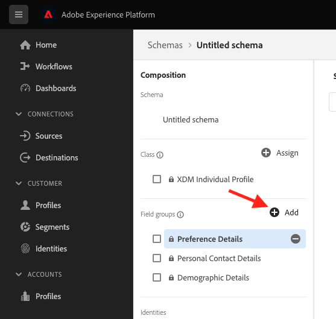

Instead of reusing an existing Field Group, you'll now create your own Field Group. You can do that by selecting **Create New Field Group**.

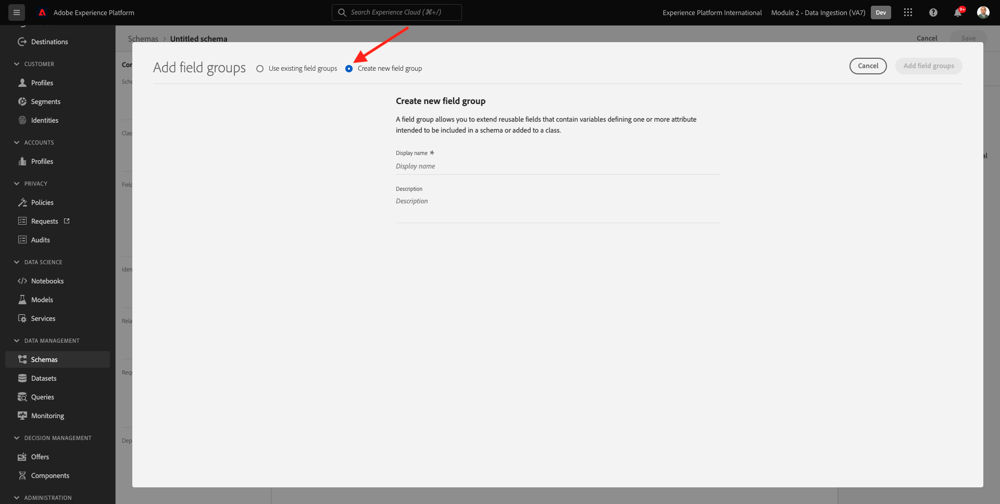

You now need to provide a **Display Name** and **Description** for your new Field Group. 

As the name for our schema, we'll use this:
`--demoProfileLdap-- - Profile Identification Field Group`

As an example, for ldap **vangeluw**, this should be the name of the schema:

**vangeluw - Profile Identification Field Group**

That should give you something like this:

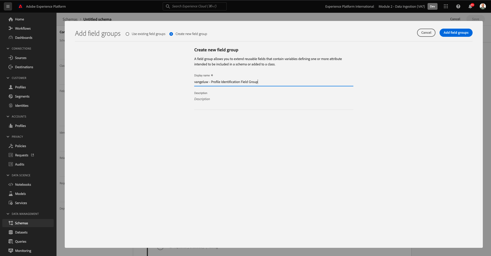

Click the **Add Field Groups** button to add the newly created Field Group to your schema.

You should now have this schema structure in place.

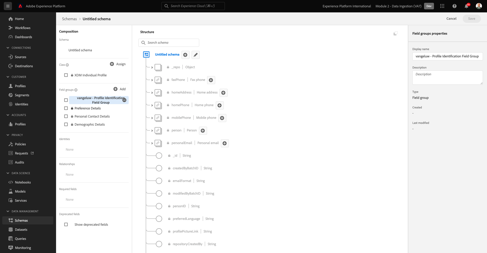

Your new Field Group is still empty, so now you'll have to add fields to that Field Group.
In the Field Group-list, click your custom Field Group.

You now see a number of new buttons appear.

On the top-level of your Schema, click the **+ Add Field** button.

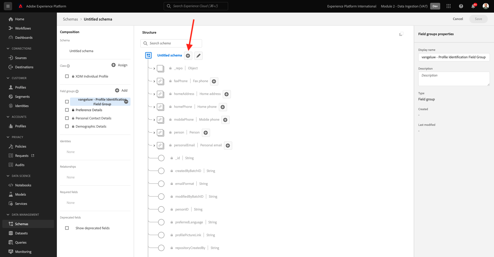

After clicking the **+ Add Field** button, you now see a new **object** in your schema. This object represents a custom **object** in your Schema and is named after your Adobe Experience Platform Tenant ID. Your Adobe Experience Platform tenant id is `--aepTenantId--`.

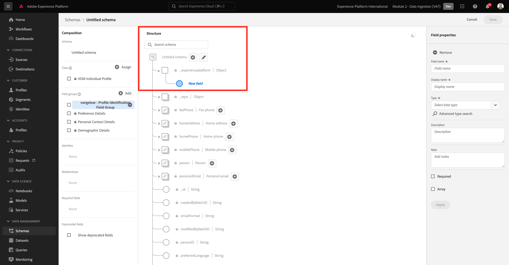

You'll now add a new object under that tenant. To do that, click the field **New Field** under the tenant-object.

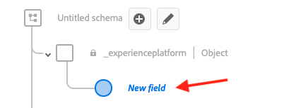

Use these object-definitions:

- Field name: **identification**
- Display name:  **identification**
- Type: **Object**

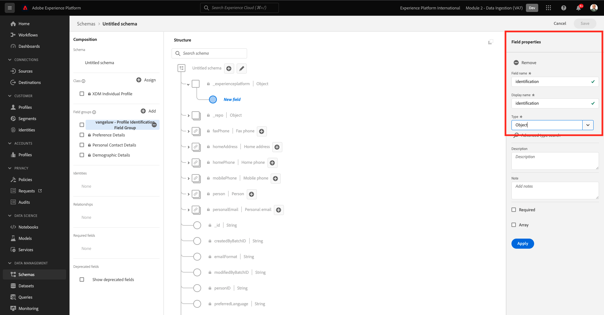

Click **Apply** to save your changes.

After clicking **Apply**, you now see your **identification** object in the Schema.

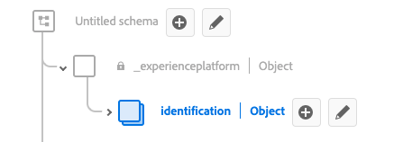

You'll now add 3 new fields under the  **identification** object:

- ecid:
  - Field name: **ecid**
  - Display name:  **ecid**
  - Type: **String**

- emailId
  - Field name: **emailId**
  - Display name:  **emailId**
  - Type: **String**
  
- mobilenr
  - Field name: **mobilenr**
  - Display name:  **mobilenr**
  - Type: **String**

Each field will be defined as type **String** and we'll configure these fields as **Identities**. For the Schema **Website Registration Schema**, we assume that a customer will always be identified by their email-address, which means that you have to configure the field **emailId** as a **primary** identifier, and the other fields as **secondary** identifiers.

To add the fields, click the **+** button next to the **identification** object.

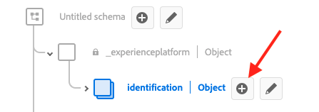

You now have an empty field. You need to configure the above 3 fields as indicated.

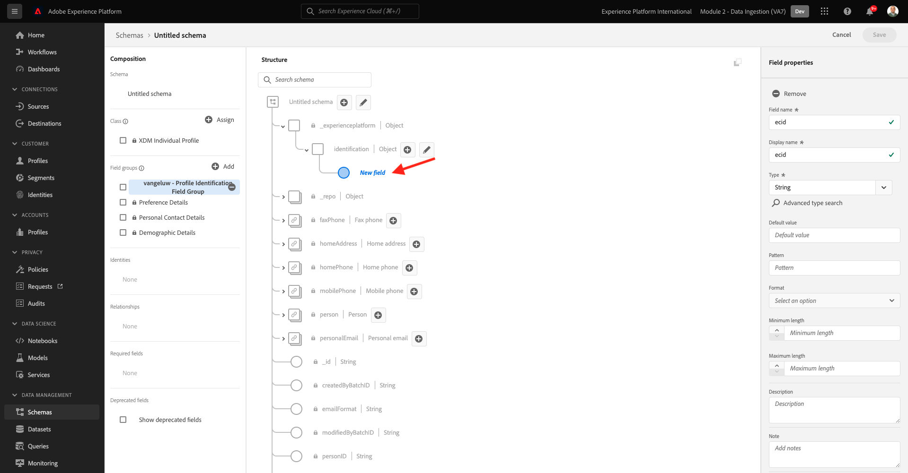

This is how each field should look after your initial field configuration.

Click the **+** button next to the **identification** object to create a new field and fill out the fields as indicated.

- ecid

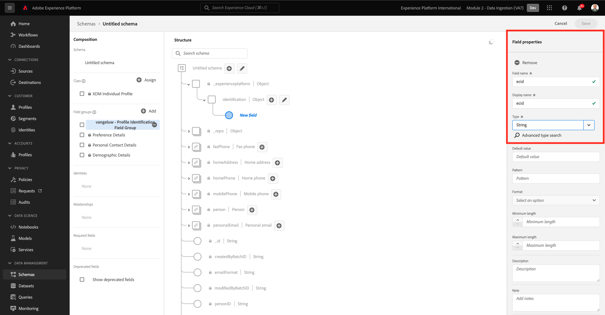

To save your field, scroll down in the **Field Properties** until you see the button **Apply**. Click the Apply** button.

Click the **+** button next to the **identification** object to create a new field and fill out the fields as indicated.

- emailId

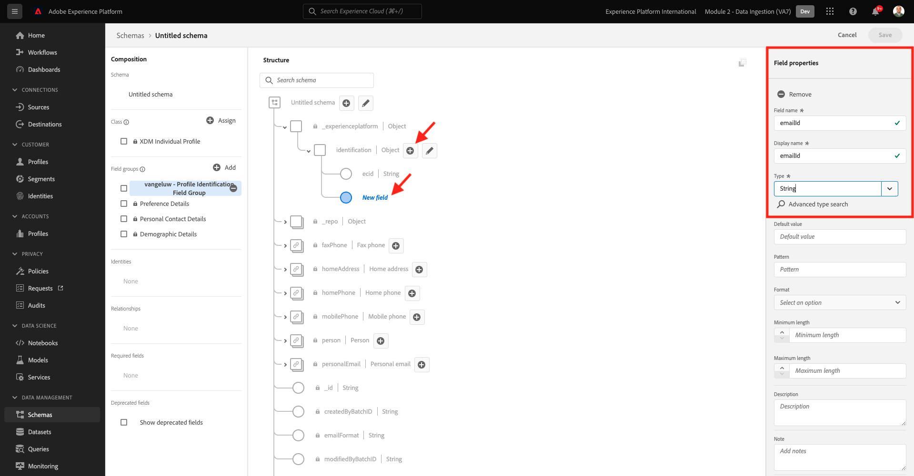

To save your field, scroll down in the **Field Properties** until you see the button **Apply**. Click the **Apply** button.

Click the **+** button next to the **identification** object to create a new field and fill out the fields as indicated.

- mobilenr

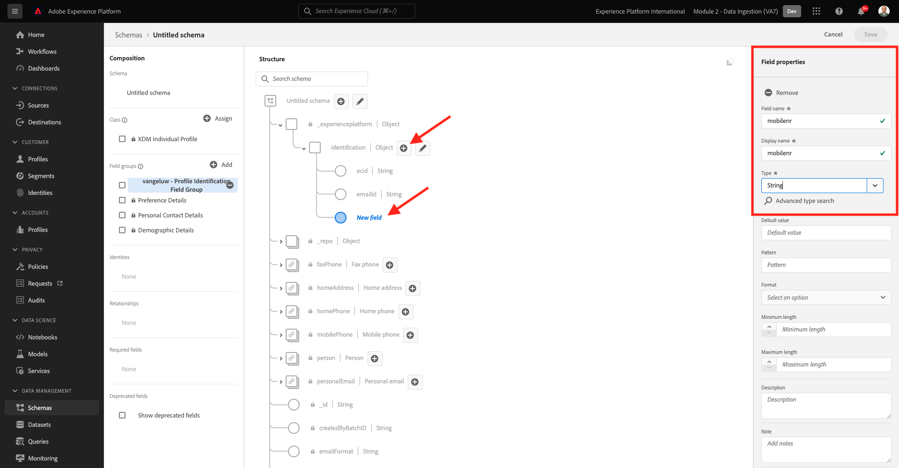

To save your field, scroll down in the **Field Properties** until you see the button **Apply**. Click the **Apply** button.

You now have 3 fields, but these fields haven't been defined as **Identity**-fields yet.

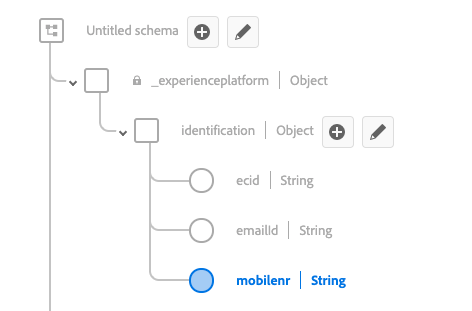

To start defining these fields as **Identity**-fields, follow these steps:

- Select the field **emailId**.
- On the right side, in the field properties, scroll down until you see **Identity**. Check the checkbox for **Identity**. 

  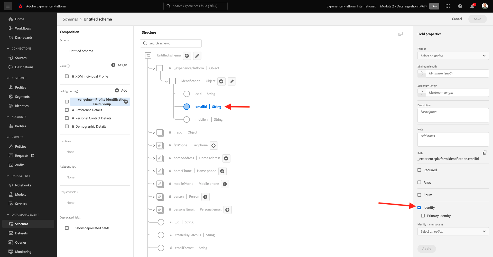

- Now check the checkbox for **Primary Identity**.

  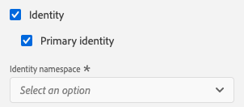
  
- Lastly, select the namespace **Email** from the list of **Namespaces**. A Namespace is used by the Identity Graph in Adobe Experience Platform to classify identifiers in namespaces and define the relationship between those namespaces.

  

- Finally, click **Apply** to save your changes.

  
  
Next, you have to define the other fields for **ecid** and **mobilenr** as secondary identifiers.

- Select the field **ecid**.
- On the right side, in the field properties, scroll down until you see **Identity**. Check the checkbox for **Identity**. 

  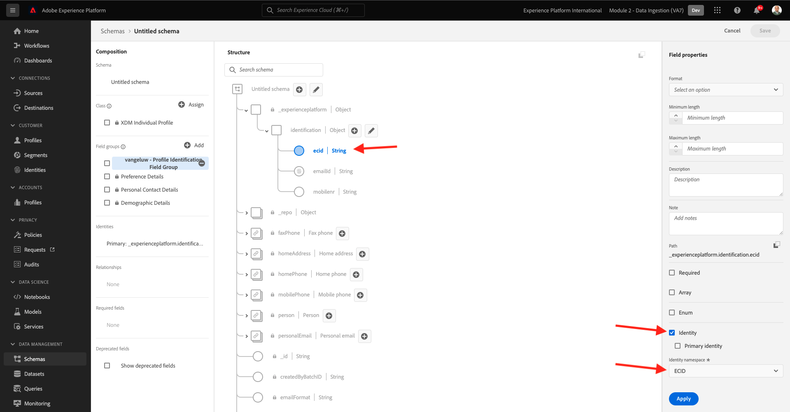

- Next, select the namespace **ECID** from the list of **Namespaces**. A [!UICONTROL Namespace] is used by the Identity Graph in Adobe Experience Platform to classify identifiers in namespaces and define the relationship between those namespaces.

  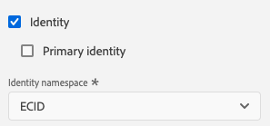

- Click **Apply** to save your changes.

  

- Select the field **mobilenr**.
- On the right side, in the field properties, scroll down until you see **Identity**. Check the checkbox for **Identity**. 

  

- Make sure to select the namespace **Phone** from the list of **Namespaces**. A Namespace is used by the Identity Graph in Adobe Experience Platform to classify identifiers in namespaces and define the relationship between those namespaces.

  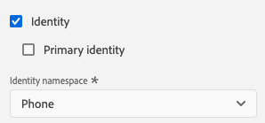

- Click **Apply** to save your changes.

  

The **identification** object should now look like this, with the 3 id-fields now also showing a **fingerprint** icon to show that they have been defined as identifiers.

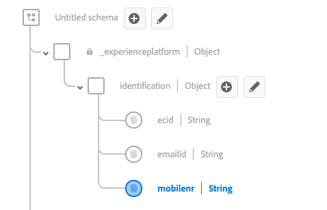

Let's now give your schema a name. Select the field **Untitled schema**.

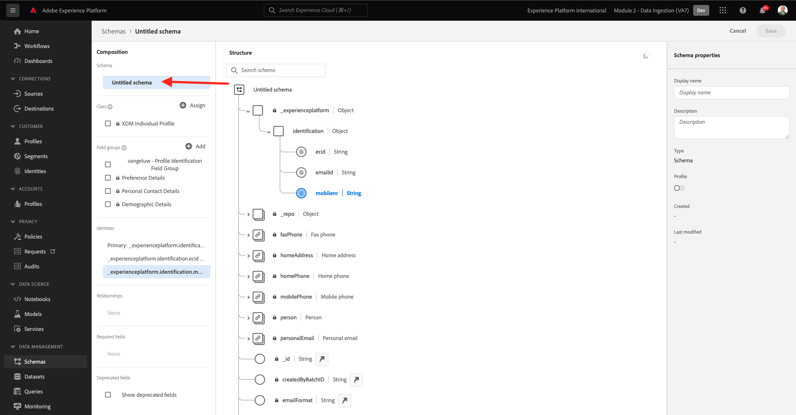

As the name for our schema, you'll use this:

`--demoProfileLdap-- - Demo System - Profile Schema for Website`

Replace **ldap** by your specific ldap. As an example, for ldap **vangeluw**, this should be the name of the schema:

**vangeluw - Demo System - Profile Schema for Website**

That should give you something like this:

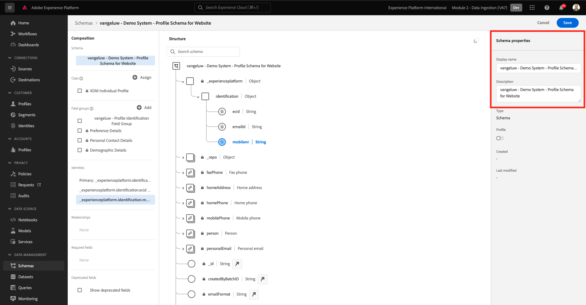

You have now defined a Schema, linked existing and newly created Field Groups and have defined identifiers.

Click **Save** to save your changes.

The last thing to do here, is to activate the Schema to be linked to the **Profile**.
By enabling your schema for Profile, you're making sure that all data sent to Adobe Experience Platform against this schema will be part of the Real-time Customer Profile environment, which makes sure that all that data can be used in real-time for querying, segmentation and activation.

To do this, let's select the name of your schema.

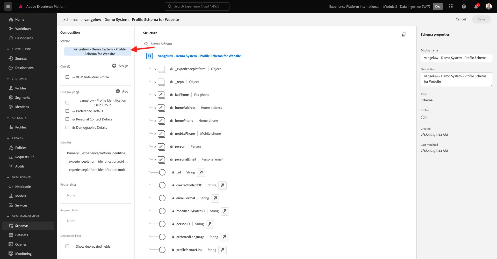

In the right tab of your schema, you'll see a **Profile toggle**, which is currently deactivated.

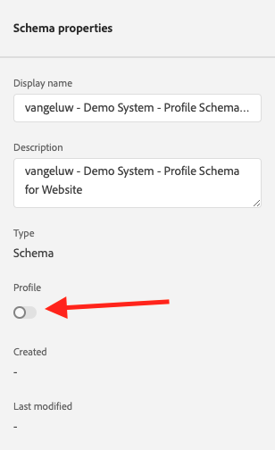

Activate the [!UICONTROL Profile] - switch by clicking it.

You'll see this message:

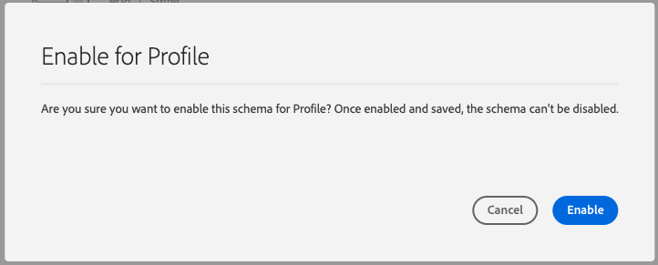

Click **Enable** to enable this schema for Profile.

Your Schema is now configured to be part of the Real-time Customer Profile.

Finally, click **Save** to save your schema.

### 2.1.2 - What does this customer do

Capturing the answer to the question **What does this customer do?** for your company is done through for instance a product view on a product page.

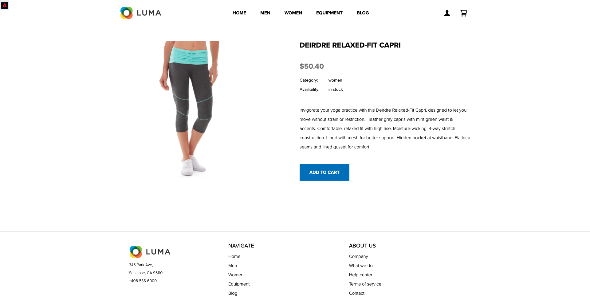

From a schema perspective, we look at this as a **Class**. The question: **What does this customer do?** is something that we've defined in the class **ExperienceEvent**.

So when you create an XDM Schema to capture the answer to **What does this customer do?**, first of all, you'll need to create and define 1 schema that references the class **ExperienceEvent**.

To specify what kind of answers can be given to that question, you'll need to define Field Group. Field Groups are extensions of the ExperienceEvent-class, and have very specific configurations. For instance, information about what kind of products a customer viewed or added to their cart is part of the Field Group **Commerce Details**.

Secondly, your company needs to decide how you'll identify the behavior of this customer. Since we're talking about interactions on a website, it's possible that your company knows the customer but it's equally possible that an unknown, anonymous visitor is active on the website. So we can't use an identifier like email-address. In this case, your company will probably decide to use the Experience Cloud ID (ECID) as the primary identifier.

Lastly, it's important to distinguish the channel on which data was captured. In this case, we'll be talking about Website Interactions and the schema that needs to be defined needs to reflect **where** the interaction data was captured. The channel will also have an important role in influencing what data is captured. As such, it's a best practice to define schema's for every combination of channel, primary identifier and type of data collected.

Based on the above, you'll need to configure a schema in Adobe Experience Platform.

After logging in, you'll land on the homepage of Adobe Experience Platform.

Before you continue, you need to select a **sandbox**. The sandbox to select is named ``--module2sandbox--``. You can do this by clicking the text **Production Prod** in the blue line on top of your screen. After selecting the appropriate sandbox, you'll see the screen change and now you're in your dedicated sandbox.

In Adobe Experience Platform, click on **Schemas** in the menu on the left side of your screen.

In [!UICONTROL Schemas], you'll see all existing schemas. 

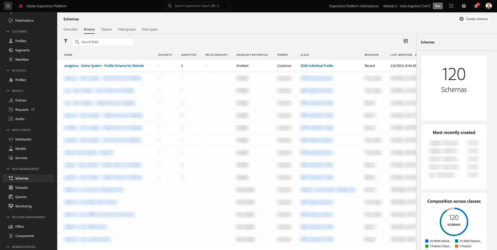

You should create a new schema. To create a new schema, click on the button **+ Create Schema** and select **XDM ExperienceEvent**.

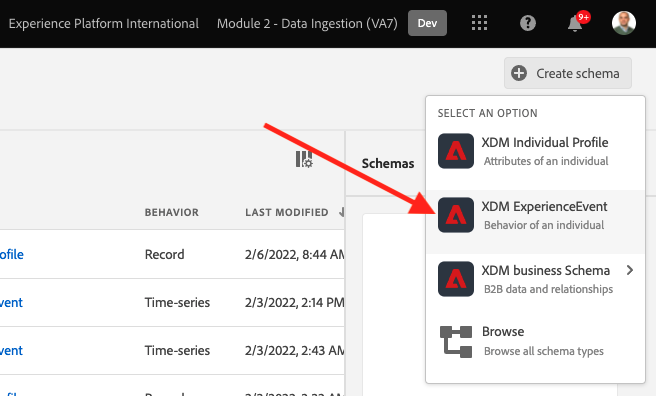

After clicking the **+ Create Schema** button, a new schema is created and you'll be prompted to select or create **field groups**.

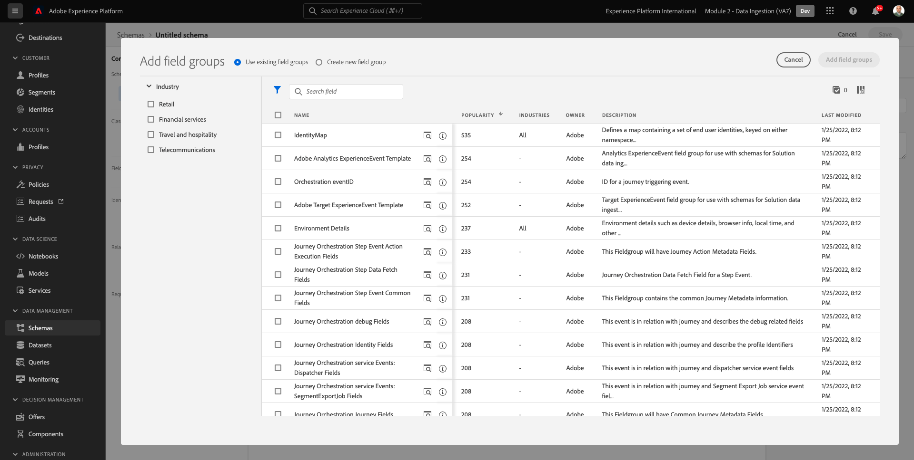

Now you need to define what an answer to the question **What does this customer do?** should look like.
In the introduction of this lab, we noted the need for following attributes to define what a customer does:

- Which pages or products have been visited? 
- Has this customer added a product to his cart or even purchased an item? 
- What device and browser has been used to browse the website? 
- What kind of information is this customer looking for and how can we use that to configure and deliver a delightful experience to this customer?
- Primary Identifier for a customer

To make that information part of your schema, you need to add the following Field Group to your schema:

- Web Details
- Commerce Details
- Environment Details
- your company's custom Profile Identification Field Group (Primary and Secondary Identifiers)

In the **Add Field Group** screen, select the Field Groups **Web Details**, **Commerce Details** and **Environment Details**.

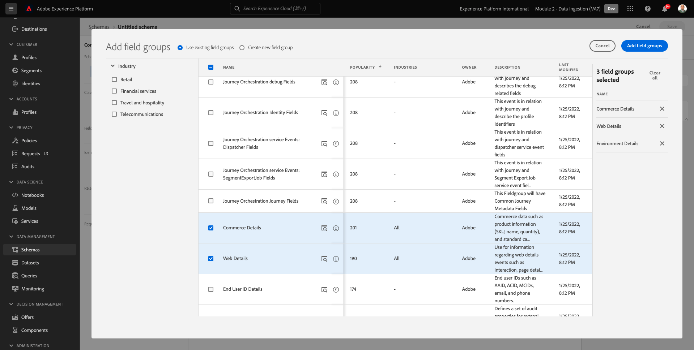

Click the **Add Field Groups** button to add the Field Group to your schema.

You'll then have this:

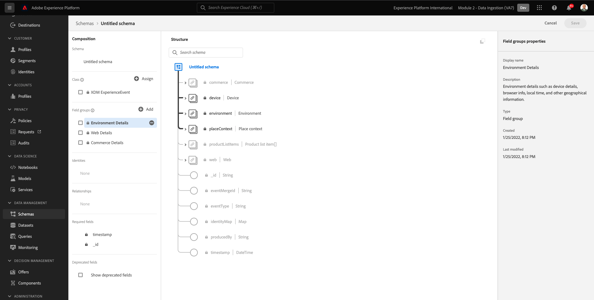

Next, you need to create a new Field Group to capture the **Identifier** used for data collection. As you've seen in the previous exercise, there's a concept of Primary and Secondary Identifiers. A Primary Identifier is the most important one, as all collected data will be linked to this Identifier.

You will now create your own custom Field Group and as such, you'll be extending the XDM Schema to meet your own company's requirements.

A Field Group is linked to a [!UICONTROL Class], so that means that you can't simply reuse the previously created Field Group.

Click the **+ Add** button to start adding a Field Group.

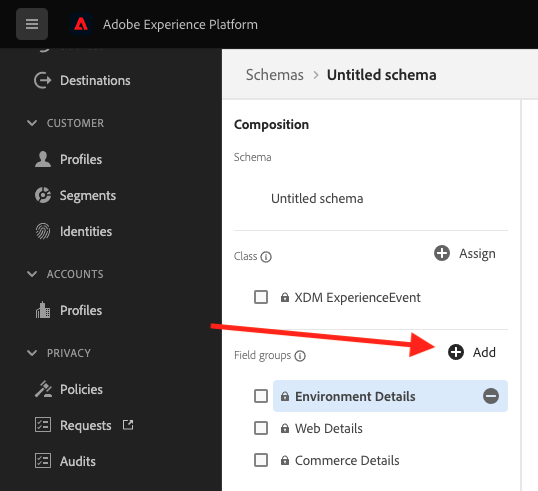

Instead of reusing an existing Field Group, you'll now create your own Field Group. You can do that by selecting **Create New Field Group**.

You now need to provide a **Display Name** and **Description** for your new Field Group. 

As the name for your Field Group, use this:

`--demoProfileLdap-- - ExperienceEvent Identification Field Group`

As an example, for ldap **vangeluw**, this should be the name of the schema:

**vangeluw - ExperienceEvent Identification Field Group**

That should give you something like this:

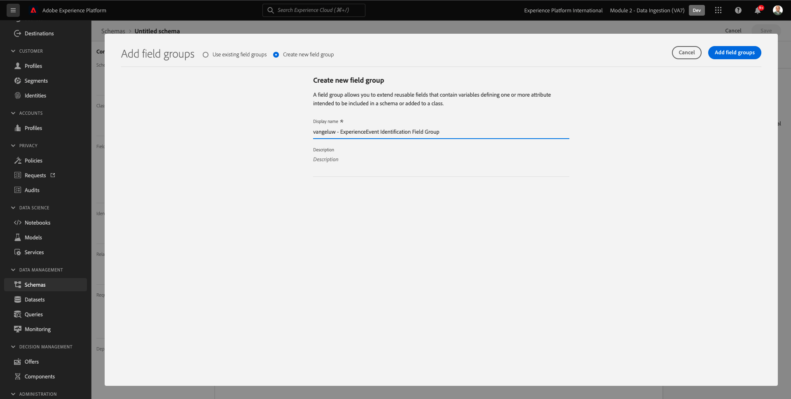

Click the **Add Field Group** button to add the newly created Field Group to your schema.

You should now have this Schema structure in place.

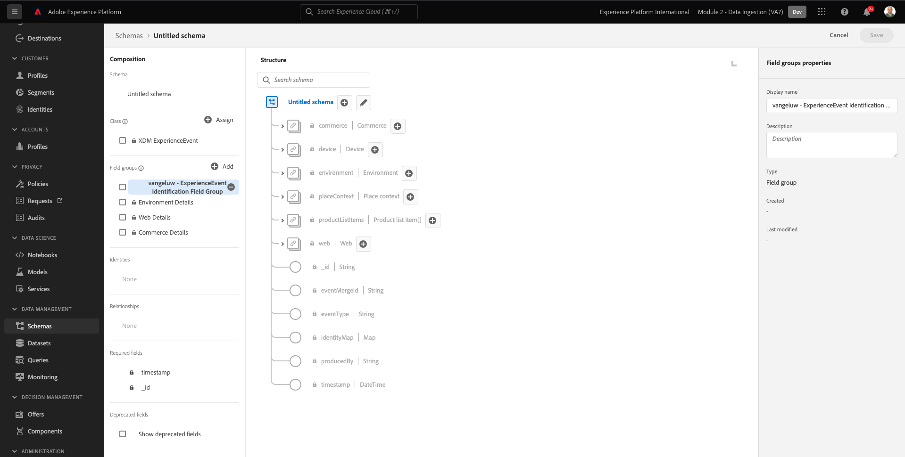

Your new Field Group is still empty, so now you'll have to add fields to that Field Group.
In the Field Group-list, click your custom Field Group.

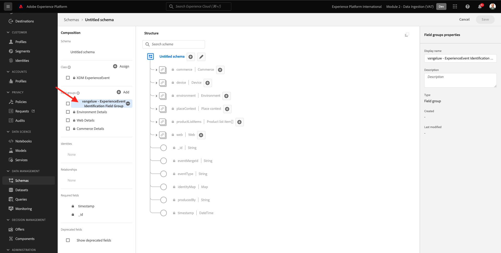

You now see a number of new buttons appear. 

On the top-level of your Schema, next to your Schema - name, click the **+** button.

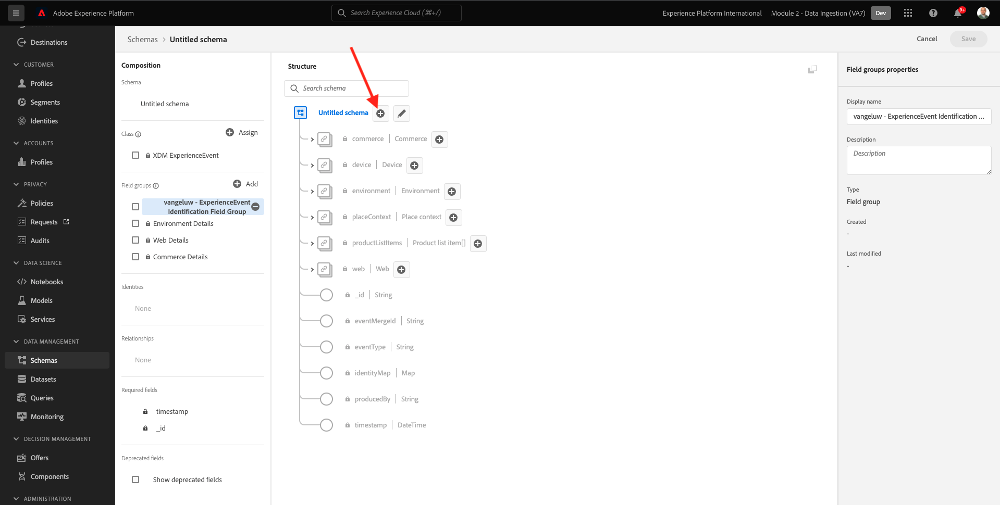

After clicking the **+** button, you now see a new **object** in your schema. This object represents a custom **object** in your Schema and is named after your Adobe Experience Platform Tenant ID. Your Adobe Experience Platform tenant id is `--aepTenantId--`.

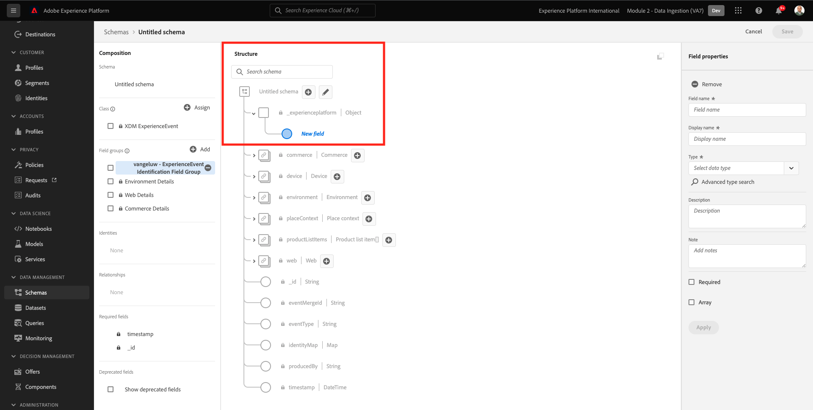

You'll now add a new object under that tenant. To do that, click the field **New Field** under the tenant-object.

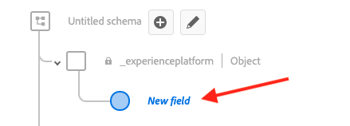

Use these object-definitions:

- Field name: **identification**
- Display name:  **identification**
- Type: **Object**

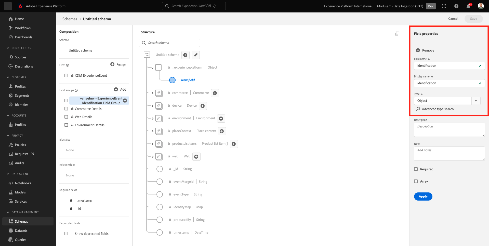

Scroll down and click **Apply** to save your changes.

After clicking **Apply**, you now see your **identification** object in the Schema.

You'll now add 1 new field under the  **identification** object.

Click the **+** button next to the **identification** object to create a new field.

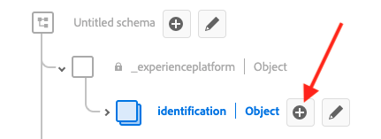

The ECID-field will be defined as type **String** and you'll configure this field as an **Identity**. For the Schema **Demo System - Event Schema for Website**, we assume that a customer will always be identified by their ECID, which means that you have to configure the field **ECID** as a **primary** identifier

You now have an empty field. You need to configure the above field as indicated.

- ecid:

  - Field name: **ecid**
  - Display name:  **ecid**
  - Type: **String**

This is how the ecid-field should look after your initial field configuration:

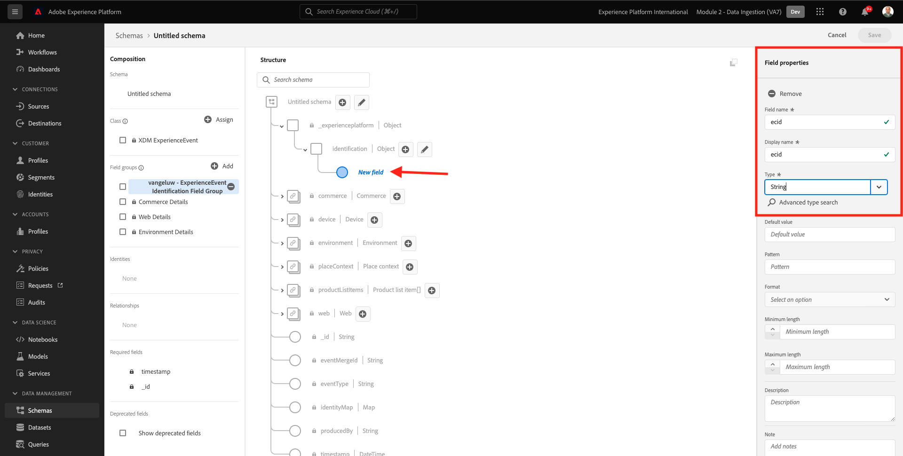

Scroll down and click **Apply**.

You now have a new field, but this field hasn't been defined as an **Identity**-field yet.

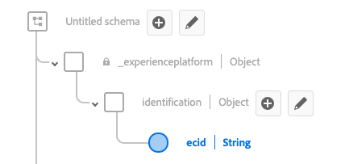

To start defining these fields as **Identity**-fields, follow these steps:

- Select the field **ecid**.
- On the right side, in the field properties, scroll down until you see **Identity**. Check the checkbox for **Identity**. 

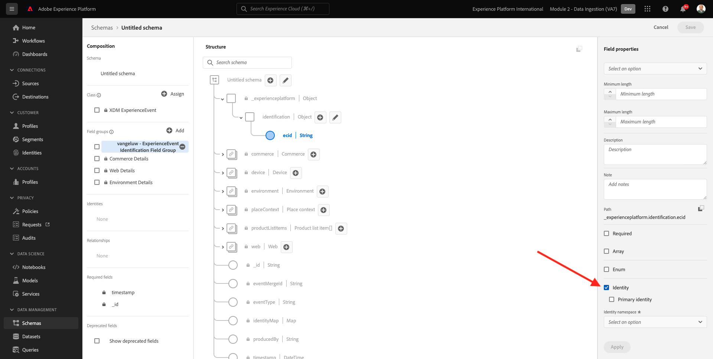

- Now check the checkbox for **Primary Identity**.

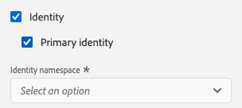
  
- Lastly, select the namespace **ECID** from the list of **Namespaces**. A Namespace is used by the Identity Graph in Adobe Experience Platform to classify identifiers in namespaces and define the relationship between those namespaces.

  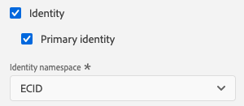

- Finally, click **Apply** to save your changes.

  

The **identification** object should now look like this, with the ecid-field now also showing a **fingerprint** icon to show that they have been defined as identifiers.

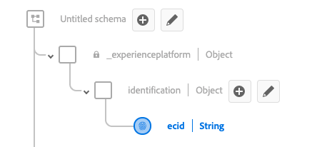

Let's now give your schema a name. Select the field **Untitled schema**.

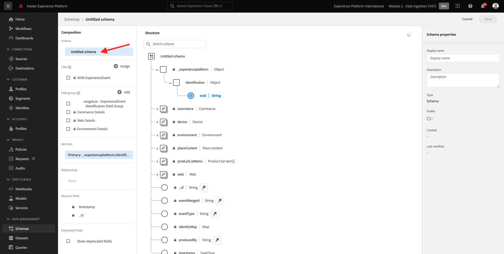

As the name for our schema, we'll use this:
`--demoProfileLdap-- - Demo System - Event Schema for Website`

As an example, for ldap **vangeluw**, this should be the name of the schema:

**vangeluw - Demo System - Event Schema for Website**

That should give you something like this:

Click **Save** to save your changes.

It's important to note that when eventually ingesting data against this schema, that some fields are required.
For instance, the fields **_id** and **timestamp** are required fields.

- _id needs to contain a unique id for a specific data ingestion
- timestamp needs to be the timestamp of this hit, in the format **"YYYY-MM-DDTHH:MM:SSSZ"**, like for instance: **"2019-04-08T07:20:000Z"**

You have now defined a schema, linked existing and newly created Field Groups and have defined identifiers.

The last thing to do here, is to activate the Schema to be linked to the **Profile**.
By enabling your schema for Profile, you're making sure that all data sent to Adobe Experience Platform against this schema will be part of the Real-time Customer Profile, which makes sure that all that data can be used in real-time for querying, segmentation and activation.

To do this, let's select the name of your schema.

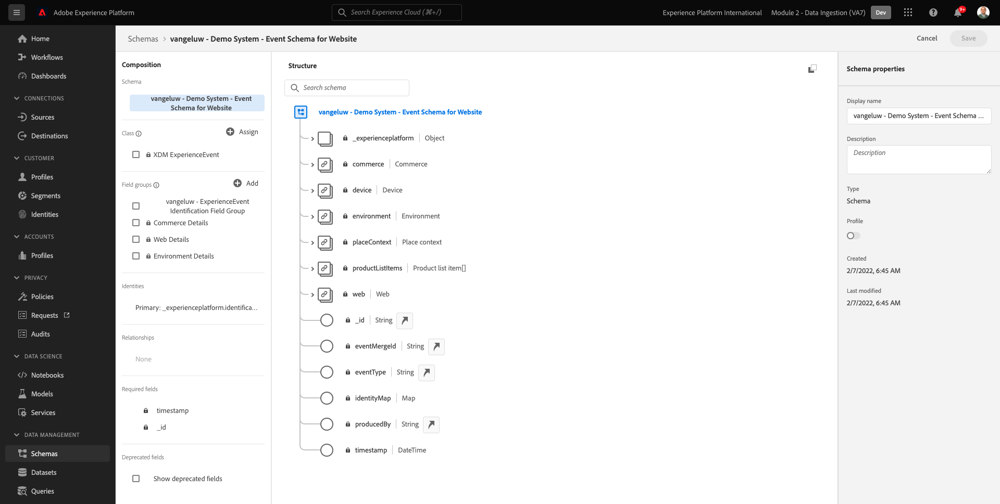

In the right tab of your schema, you'll see a **Profile] toggle**, which is currently deactivated.

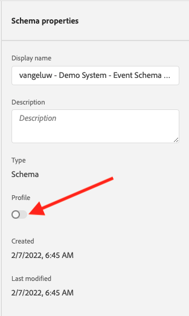

Activate the Profile - switch by clicking it.

You'll see this message:

Click **Enable** to enable this schema for Profile.

Your schema is now configured to be part of the Real-time Customer Profile.

Finally, click **Save** to save your schema.

You've now finished building schemas that are activated to be used in the Real-time Customer Profile.

Let's have a look at datasets in the next exercise.
