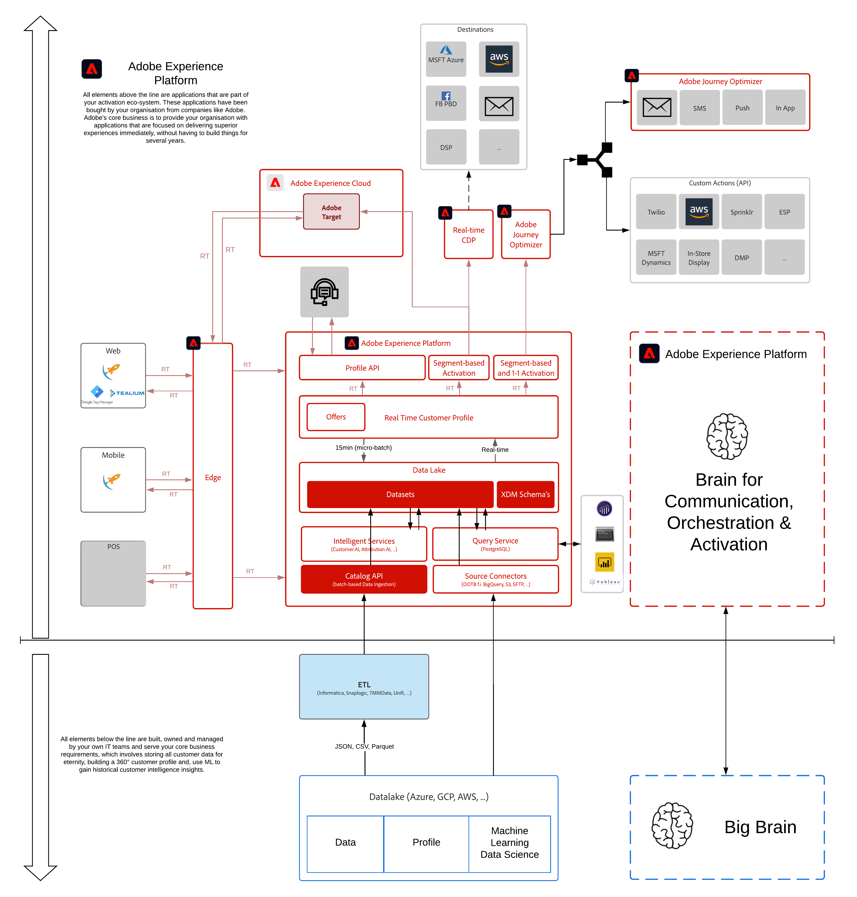

# 5. Intelligent Services

**Authors: [Diptiman Badajena](https://www.linkedin.com/in/diptiman-badajena-1b178019/), [Wouter Van Geluwe](https://www.linkedin.com/in/woutervangeluwe/)**

In this module, you'll learn how to setup, configure and use Adobe Experience Platform Intelligent Services.

## Learning Objectives

- Become familiar with Adobe Experience Platform
- Configure Schema / Dataset for use with Intelligent Services
- Create a new Customer AI instance
- Scoring dashboard and segmentation

## Prerequisites

- Access to Adobe Experience Platform: [https://experience.adobe.com/platform](https://experience.adobe.com/platform)


This tutorial was created to facilitate a particular workshop format. It uses specific systems and accounts to which you might not have access. Even without access, we think you can still learn a lot by reading through this very detailed content. If you're a participant in one of the workshops and need your access credentials, please contact **<spphelp@adobe.com>**, who will provide you with the required information.


## Architecture Overview

Have a look at the below architecture, which highlights the components that will be discussed and used in this module.

## Sandbox to use


Kindly refer to [Exercise 0.0](../getting-started/ex0.md) for instructions on how to find your Sandbox ID and other identifying values.


## Exercises

[5.1 Customer AI - Data Preparation (Ingest)](./ex1.md)

Customer data is ingested and transformed with the Experience Data Model (XDM) on Adobe Experience Platform. Specifically, all datasets that are used in Intelligent Services must conform to the Consumer ExperienceEvent (CEE) XDM schema.

[5.2 Customer AI - Create a New Instance (Configure)](./ex2.md)

The marketing analyst configures the desired predictions by specifying business rules and identifying relevant data. After configuring the model, schedule executions and review scores.

[5.3 Customer AI - Scoring Dashboard and Segmentation (Predict & Take Action)](./ex3.md)

After the models have finished training and scoring, the scores are written back into Platform. You can decide what actions to take with the predictions, such as defining segments, building custom dashboards etc.


Thank you for investing your time in learning all there is to know about Adobe Experience Platform. If you have questions, want to share general feedback of have suggestions on future content, please contact the Solution Partner Portal, by sending an email to **spphelp@adobe.com**.

