# 5.1 Customer AI - Data Preparation (Ingest)

In order for Intelligent Services to discover insights from your marketing events data, the data must be semantically enriched and maintained in a standard structure. Intelligent Services leverages Adobe's Experience Data Model (XDM) schemas in order to achieve this.
Specifically, all datasets that are used in Intelligent Services must conform to the **Consumer Experience Event** XDM schema.

## 5.1.1 Create Schema

In this exercise, you'll create a schema that contains the **Consumer Experience Event mixin**, which is required by the **Customer AI** Intelligent Service.

Log in to Adobe Experience Platform by going to this URL: [https://experience.adobe.com/platform](https://experience.adobe.com/platform).

After logging in, you'll land on the homepage of Adobe Experience Platform.

Before you continue, you need to select a **sandbox**. The sandbox to select is named ``--module10sandbox--``. You can do this by clicking the text **[!UICONTROL Production Prod]** in the blue line on top of your screen. After selecting the appropriate sandbox, you'll see the screen change and now you're in your dedicated sandbox.

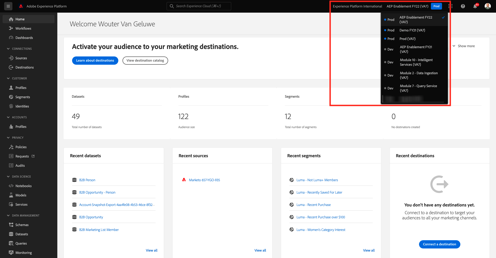

From the left menu, click **Schemas** and go to **Browse**. Click **Create Schema**.

In the popup, select **XDM ExperienceEvent**.

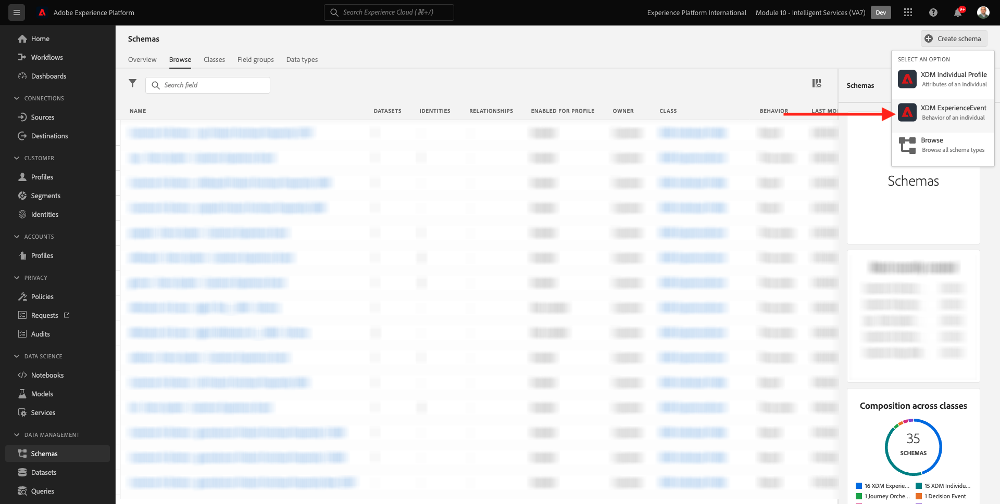

You'll then see this.

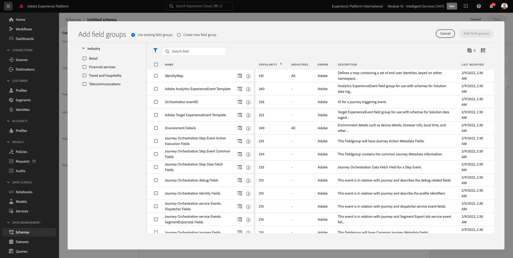

Search and select the following **Mixins** to add to this Schema:

- Consumer Experience Event

  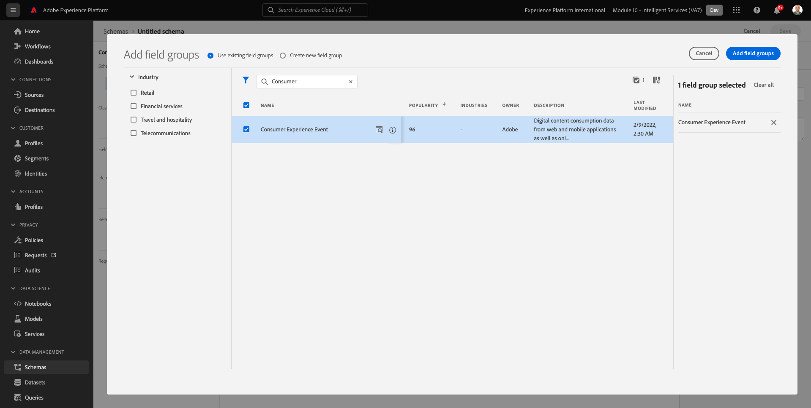

- End User ID Details

  

Click **Add Field Groups**.

You'll then see this. Select the Mixin **End User ID Details**.

Navigate to the field **endUserIDs._experience.emailid.id**.

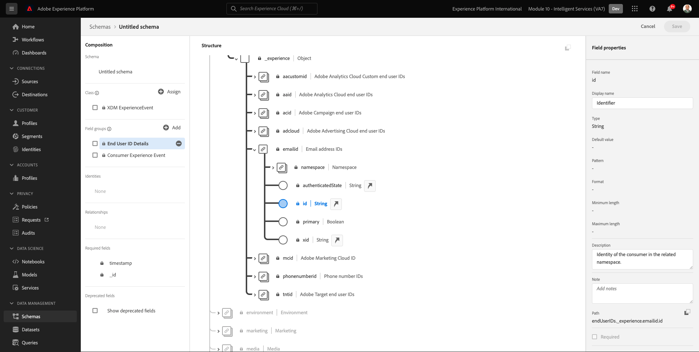

In the right menu for the field **endUserIDs._experience.emailid.id**, scroll down and check the checkbox for **Identity**, check the checkbox for **Primary Identity** and select the **Identity namespace** of **Email**.

Navigate to the field **endUserIDs._experience.mcid.id**. Check the checkbox for **Identity** and select the **Identity namespace** of **ECID**. Click **Apply**.

Give your schema a name now.

As the name for our schema, you'll use this:

- `--demoProfileLdap-- - Demo System - Customer Experience Event`

As an example, for ldap **vangeluw**, this should be the name of the schema:

- **vangeluw - Demo System - Customer Experience Event**

That should give you something like this. Click the **+ Add** button to add new **Mixins**.

Select the name of your schema. You should now enable your schema for **Profile**, by clicking the **Profile** toggle.

You'll then see this. Click **Enable**.

You should now have this. Click **Save** to save your schema.

## 5.1.2 Create Dataset

From the left menu, click **Datasets** and go to **Browse**. Click **Create dataset**.

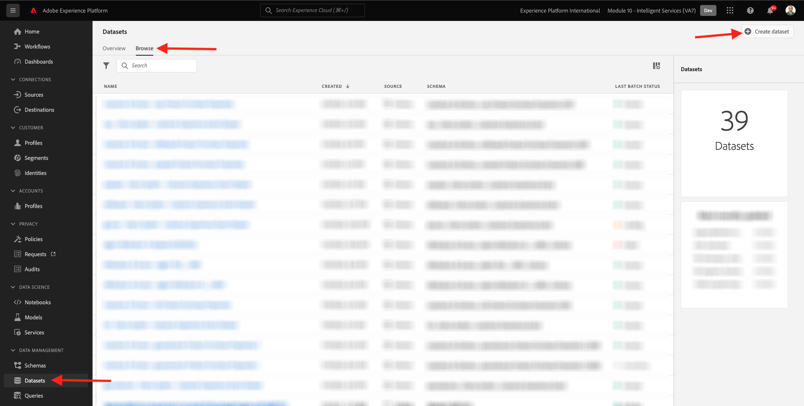

Click **Create dataset from schema**.

In the next screen, select the dataset you created in the previous exercise, which is named **[!UICONTROL ldap - Demo System - Customer Experience Event]**. Click **Next**.

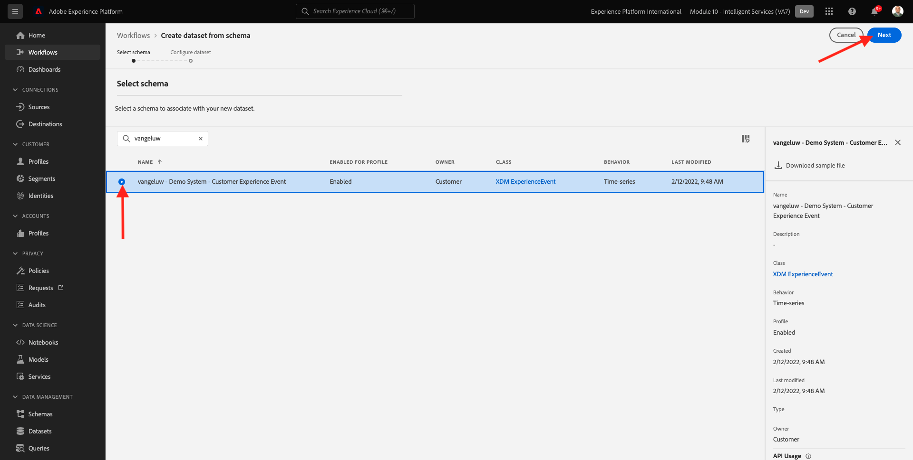

As a name for your dataset, use `--demoProfileLdap-- - Demo System - Customer Experience Event Dataset`. Click **Finish**.

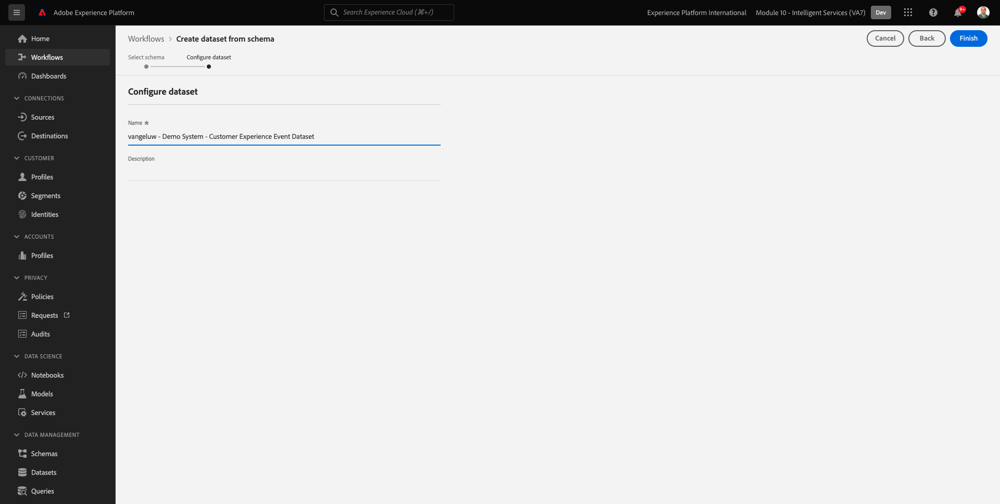

Your dataset is now created. Enable the **Profile** toggle.

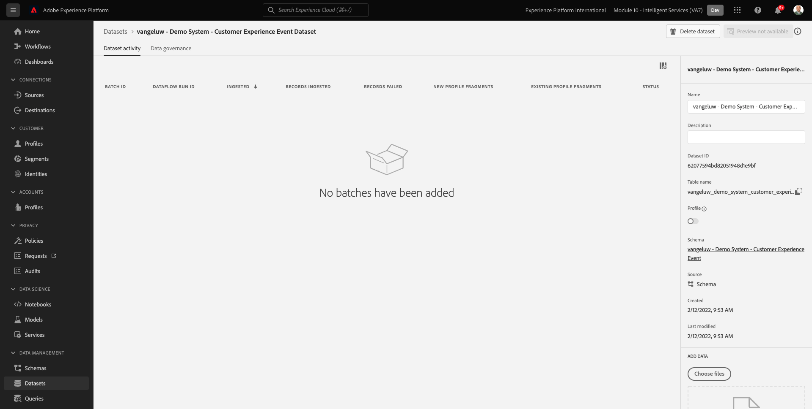

Click **Enable**.

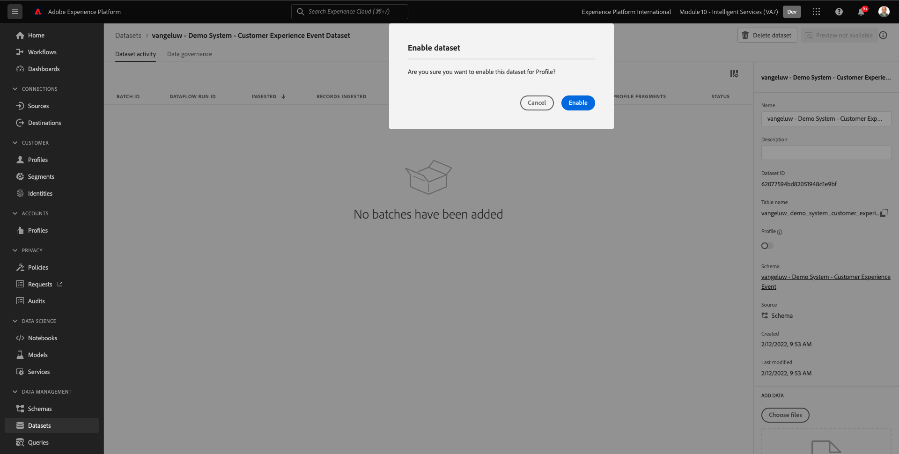

You should now have this:

You're now ready to start ingesting Consumer Experience Event data and start using the Customer AI service.

## 5.1.3 Download Experience Event test data

Once the **Schema** and **Dataset** are configured, you're now ready to ingest Experience Event data. Since Customer AI requires data across **2 quarters at least**, you'll need to ingest externally prepared data.

The data prepared for the experience events must comply to the requirements and schema of the [Consumer Experience Event XDM Mixin](https://github.com/adobe/xdm/blob/797cf4930d5a80799a095256302675b1362c9a15/docs/reference/context/experienceevent-consumer.schema.md).

Please download the file containing sample data from this location: [https://dashboard.adobedemo.com/data](https://dashboard.adobedemo.com/data). Click the **Download** button.

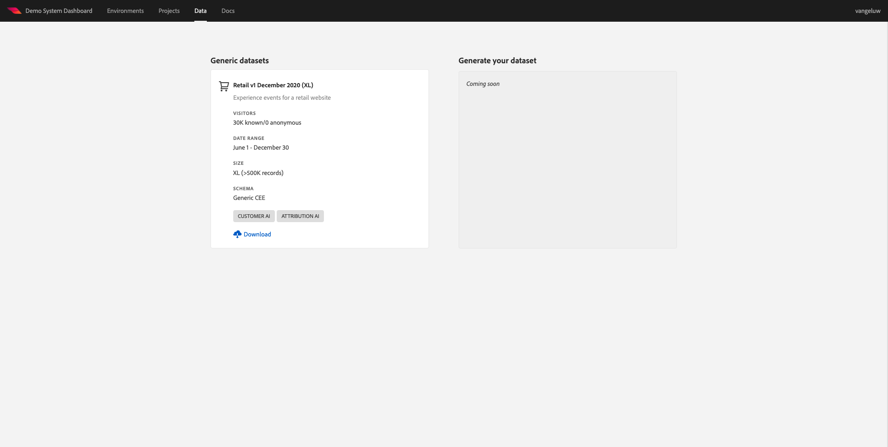

Alternatively, if you can't access the above link, you can download the file also from this location: [https://aepmodule10.s3-us-west-2.amazonaws.com/retail-v1-dec2020-xl.json.zip](https://aepmodule10.s3-us-west-2.amazonaws.com/retail-v1-dec2020-xl.json.zip).

You've now downloaded a file named **retail-v1-dec2020-xl.json.zip**. Place the file on your computer's desktop and unzip it, after which you'll see a file named **retail-v1.json**. You'll need this file in the next exercise.

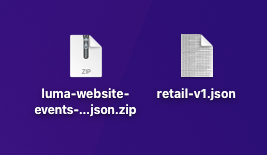

## 5.1.4 Ingest Experience Event test data

In Adobe Experience Platform, go to **Datasets** and open your dataset, which is named **ldap - Demo System - Customer Experience Event Dataset**.

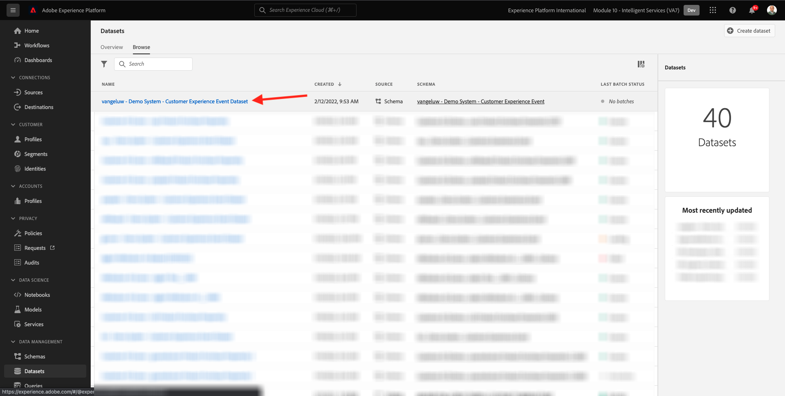

In your dataset, click **Choose files** to add data.

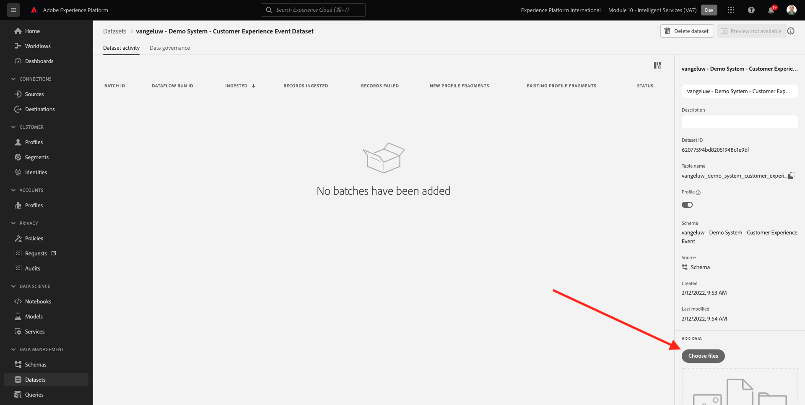

In the popup, select the file **retail-v1.json** and click **Open**.

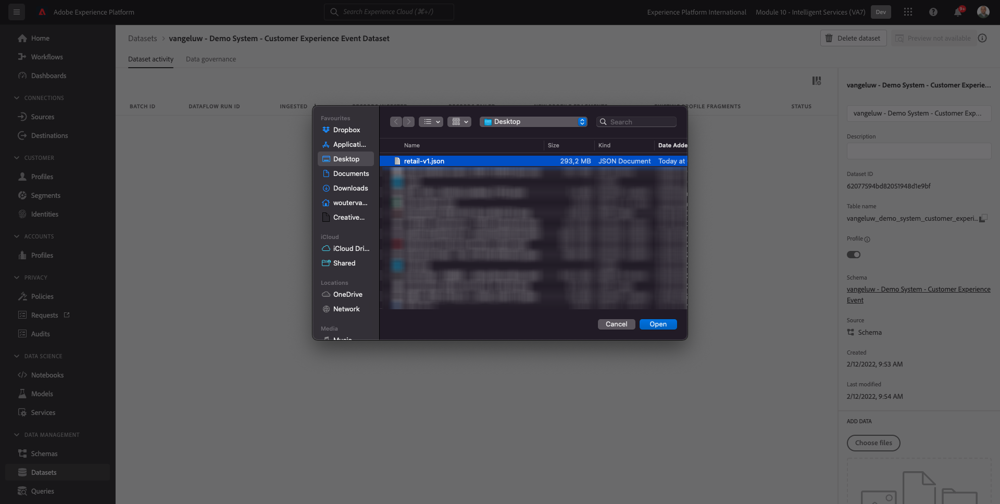

You'll then see the data being imported, and a new batch is created in the **Loading** state. Don't navigate away from this page until the file is uploaded.

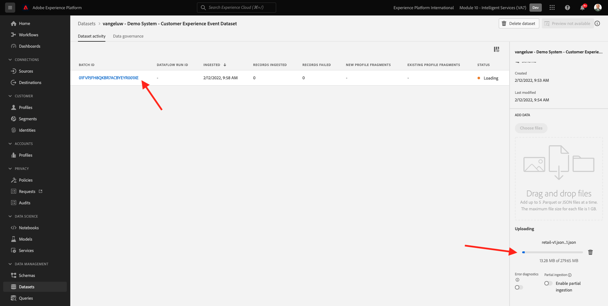

Once the file has been uploaded, you'll see the batch status change from **Loading** to **Processing**.

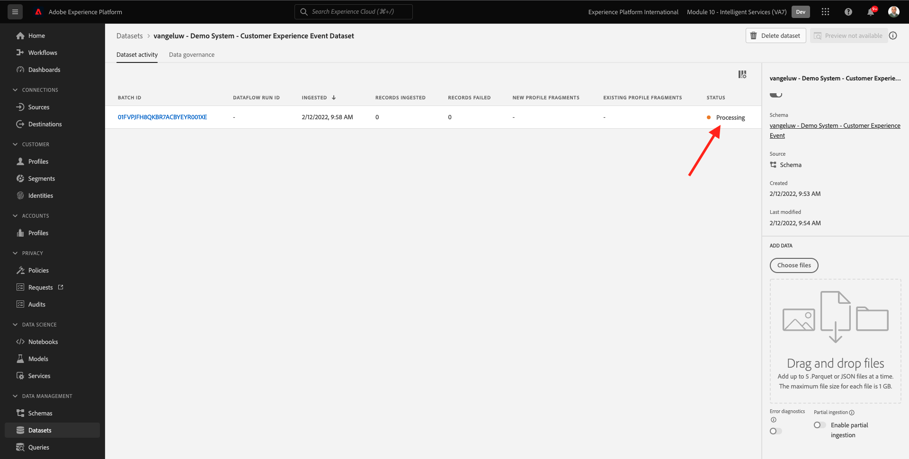

Ingesting and processing the data might take 10-20min.

Once data ingestion is successful, the batch status will change to **Success**.

