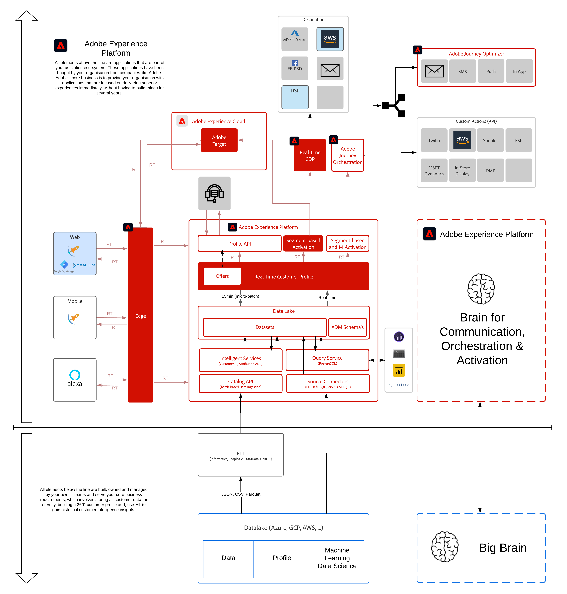

# 6. Real-time CDP - Build a segment and take action

**Author: [Wouter Van Geluwe](https://www.linkedin.com/in/woutervangeluwe/), [Alberto De Caro](https://www.linkedin.com/in/albertodecaro/), [Benedikt Wedenik](https://www.linkedin.com/in/benedikt-wedenik/)**

In this module, you'll configure a streaming segment and activate the segment to multiple destinations.

## Learning Objectives

- Learn how to build a segment and enable it for streaming.
- Learn how to configure an advertising destination using the Adobe Experience Platform UI.
- Learn how to connect a segment to a destination and activate it.
- Learn how to use Adobe Experience Platform segments in Adobe Audience Manager, and how to use Adobe Audience Manager segments in Adobe Experience Platform, thanks to bi-directional segment sharing.

## Prerequisites

- Access to Adobe Experience Platform: [https://experience.adobe.com/platform](https://experience.adobe.com/platform)
- Access to Adobe Target
- Access to AWS S3


This tutorial was created to facilitate a particular workshop format. It uses specific systems and accounts to which you might not have access. Even without access, we think you can still learn a lot by reading through this very detailed content. If you're a participant in one of the workshops and need your access credentials, please contact **<spphelp@adobe.com>**, who will provide you with the required information.


## Architecture Overview

Have a look at the below architecture, which highlights the components that will be discussed and used in this module.

## Sandbox to use

For this module, please use this sandbox: `--module11sandbox--`.

## Exercises

[6.1 Create a segment](./ex1.md)

Learn how to create a segment.

[6.2 Review how to configure DV360 Destination using Destinations](./ex2.md)

Learn how to configure an advertising destination using the Real-Time CDP UI.

[6.3 Take Action: send your segment to DV360](./ex3.md)

Connect the segment you built in exercise 6.1 to the destination DV360.

[6.4 Take Action: send your segment to an S3-destination](./ex4.md)

Use the segment you built in exercise 6.1 and send it to an S3-destination, typically used for Email Marketing-destinations.

[6.5 Take Action: send your segment to Adobe Target](./ex5.md)

Use the segment you built in exercise 6.1 to configure an Experience Targeting Activity in Adobe Target.

[6.6 External Audiences](./ex6.md)

Import audiences from an external source system into Adobe Experience Platform.

[6.7 Destinations SDK](./ex7.md)

Configure your own destination using Destinations SDK.

[Summary and benefits](./summary.md)

Summary of this module and overview of the benefits.


Thank you for investing your time in learning all there is to know about Adobe Experience Platform. If you have questions, want to share general feedback of have suggestions on future content, please contact the Solution Partner Portal, by sending an email to **spphelp@adobe.com**.

