# 9.3 Prepare your Adobe Experience Platform Data Collection Client property and Web SDK setup for Offer Decisioning

{% hint style="info"}
The use of Offer Decisioning in Adobe Experience Platform Web SDK is currently available in early access to select users. This functionality is not available to all IMS organizations. Please reach out to **<spphelp@adobe.com>** to get Offer Decisioning enabled in your partner IMS Org if it is not yet enabled.


## 9.3.1 Update your Datastream

In [Exercise 0.2](../getting-started/ex2.md), you created your own **[Datastream]**. You then used the name `--demoProfileLdap-- - Demo System Datastream`.

In this exercise, you need to configure that **[Datastream]** to work with **[!DNL Offer Decisioning]**.

To do that, go to [https://experience.adobe.com/#/data-collection/](https://experience.adobe.com/#/data-collection/). You'll then see this. Click **[Datastreams]** or **[Datastreams (Beta)]**. 

In the top right corner of your screen, select your sandbox name, which should be `--aepSandboxId--`.

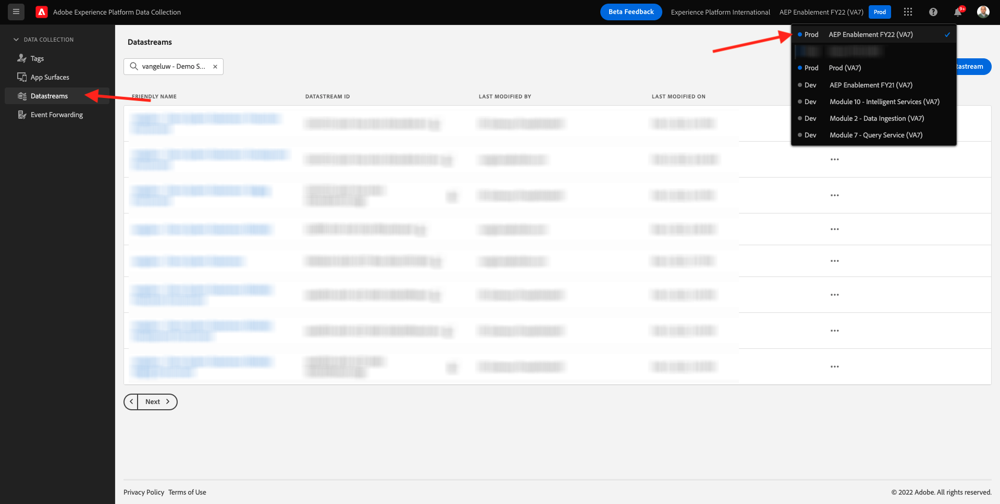

Search for your **[Datastream]**, which is named `--demoProfileLdap-- - Demo System Datastream`. Click your **[Datastream]** to open it. 

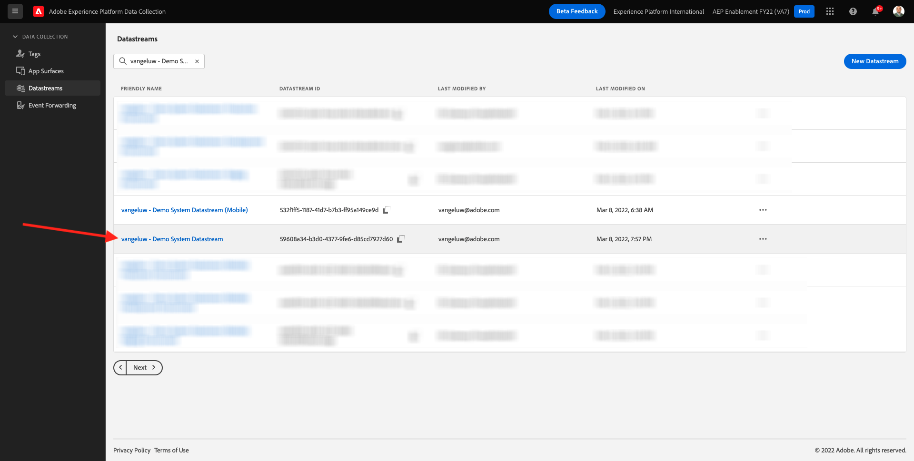

You'll then see this. Click **...** next to **Adobe Experience Platform** and then click **Edit**.

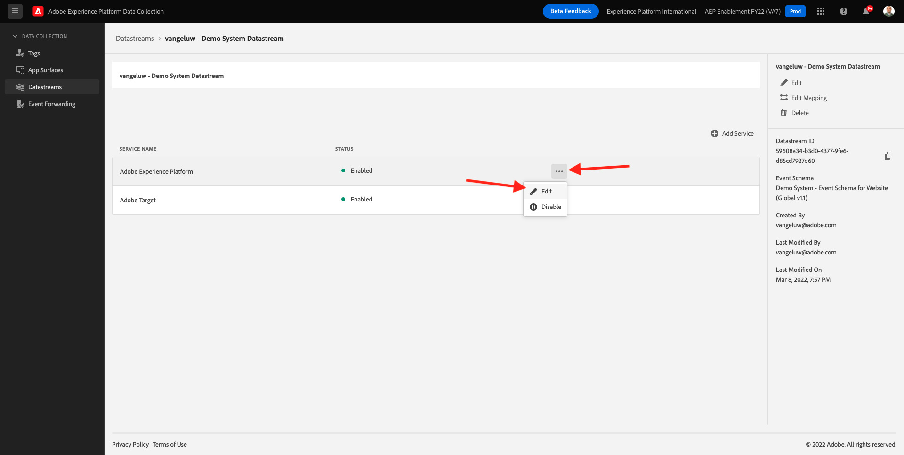

To enable **[!DNL Offer Decisioning]**, check the box for **[!DNL Offer Decisioning]**. Click **Save**.

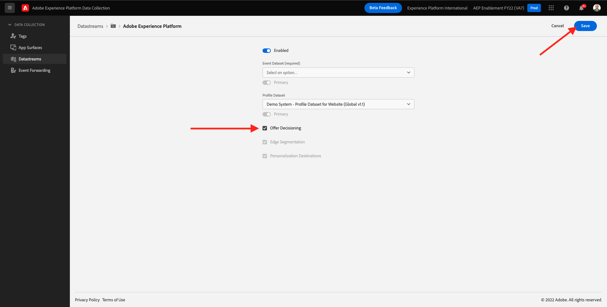

Your **[Datastream]** is now ready to work with **[!DNL Offer Decisioning]**.

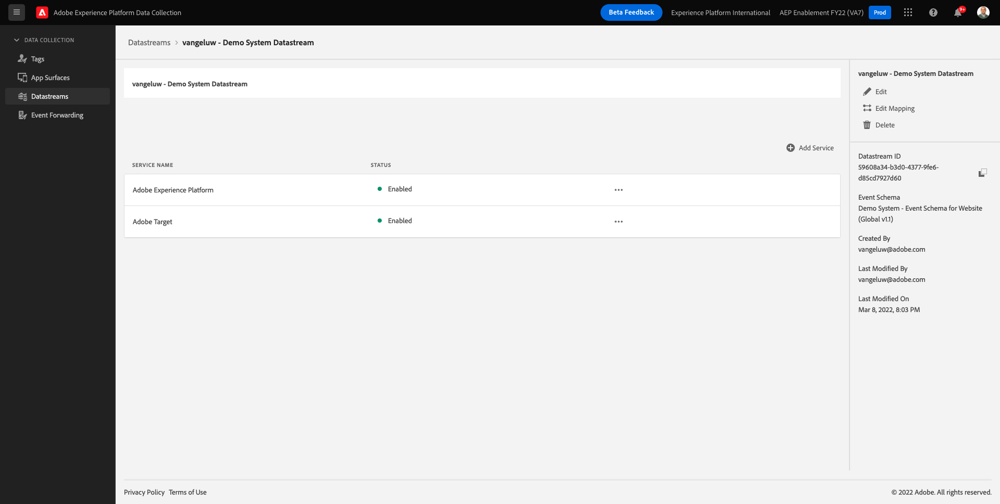

## 9.3.2 Configure your Adobe Experience Platform Data Collection Client property to request Personalized Offers

Go to [https://experience.adobe.com/#/data-collection/](https://experience.adobe.com/#/data-collection/), to **[Client]**. Search for your Data Collection properties, which are named `--demoProfileLdap-- - Demo System (DD/MM/YYYY)`. Open your Data Collection client property for web.

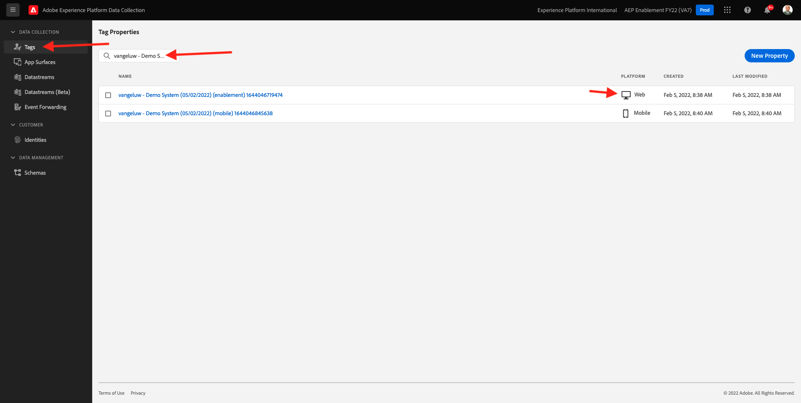

In you property, go to **[Rules]** and open the rule **[Page View]**. 

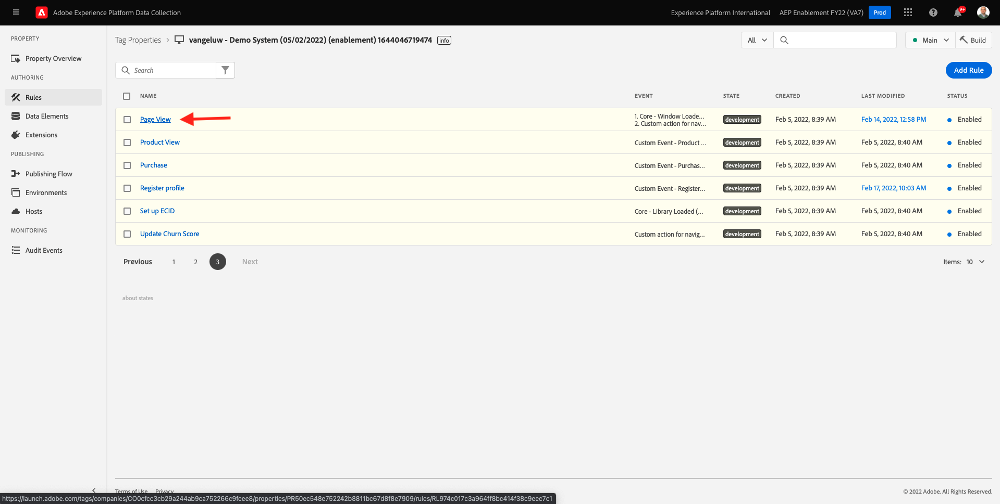

Click to open the [Action] **[AEP Web SDK - Send Event]**.

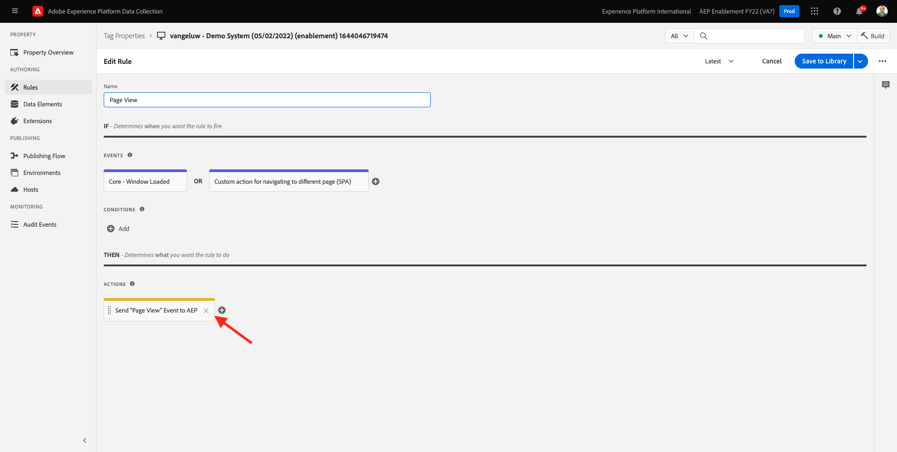

You'll then see this. You'll notice the menu option for **[Decision Scopes]**.

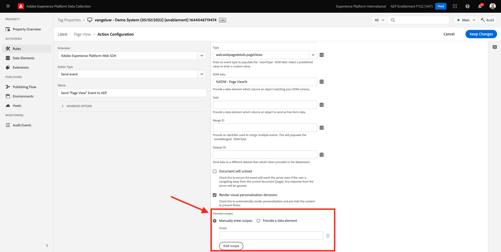

For every request sent to the edge and to Adobe Experience Platform, it's possible to provide one or more **[Decision Scopes]**. A **[Decision Scope]** is a combination of two elements:

- [Decision ID]
- [Placement ID]

Let's first have a look where you can find those two elements.

### 9.3.2.1 Retrieve your [Placement ID]

The [Placement ID] identifies the location and type of asset that is required. For instance, the hero image on the Luma website homepage corresponds with the [Placement ID] for [Web - Image].


As part of module 6, you already configured an Adobe Target Experience Targeting activity that will change the image of the hero location on the homepage, as you can see in the screenshot. For the sake of the exercise, you'll now make your offers appear on the image below the hero image as indicated in the screenshot. 


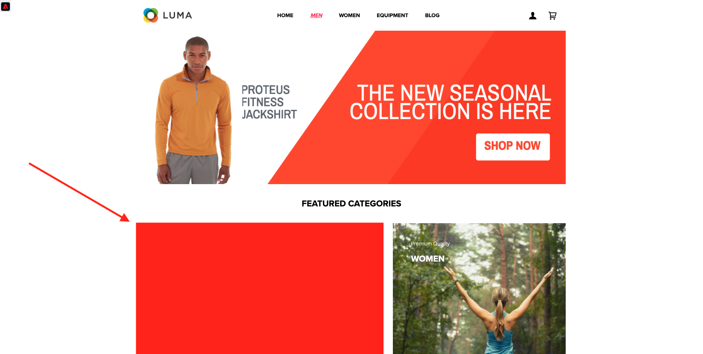

To find the [Placement ID] for [Web - Image] go to Adobe Journey Optimizer by going to [Adobe Experience Cloud](https://experience.adobe.com). Click **Journey Optimizer**.

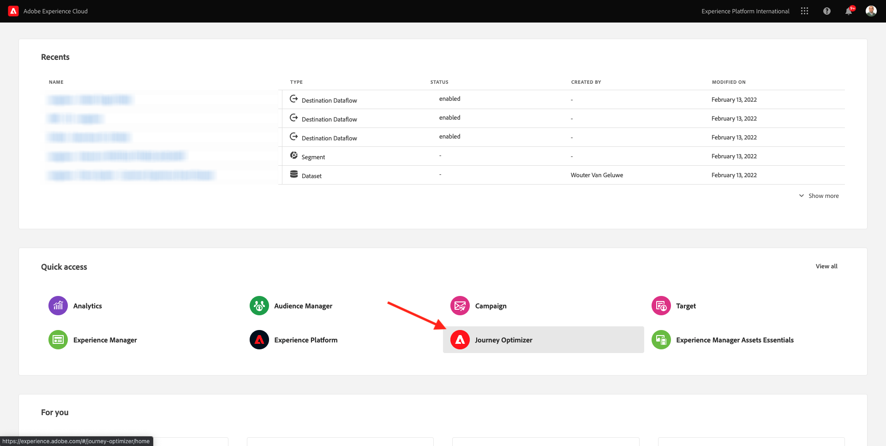

You'll be redirected to the **Home**  view in Journey Optimizer. First, make sure you're using the correct sandbox. The sandbox to use is called `--aepSandboxId--`. To change from one sandbox to another, click on **PRODUCTION Prod (VA7)** and select the sandbox from the list. In this example, the sandbox is named **AEP Enablement FY22**. You'll then be in the **Home** view of your sandbox `--aepSandboxId--`.

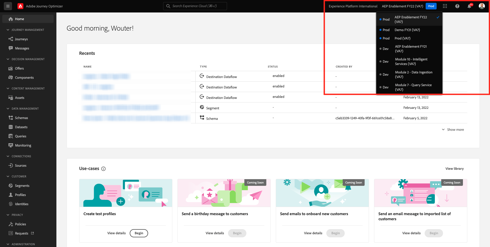

Next, go to [Components] and then to [Placements]. Click the [Web - Image] placement to see its details.

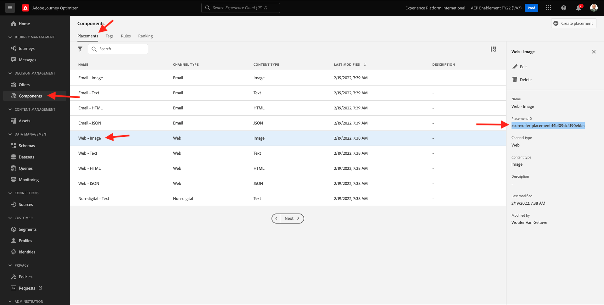

As you can see in the above image, in this example the [Placement ID] is `xcore:offer-placement:14bf09dc4190ebba`. Write down the [Placement ID] for your placement for [Web - Image] as you'll need it in the next exercise.

### 9.3.2.2 Retrieve your [Decision ID]

The [Decision ID] identifies which combination of Personalized Offers and Fallback Offer you'd like to use. In the previous exercise, you created your own [Decision] and named it `--demoProfileLdap-- - Luma Decision`.

To find the [Decision ID] for your `--demoProfileLdap-- - Luma Decision`, go to [https://platform.adobe.com](https://platform.adobe.com). 

Next, go to [Offers] and then go to [Decisions]. Click to select your [Decision], which is named `--demoProfileLdap-- - Luma Decision`.

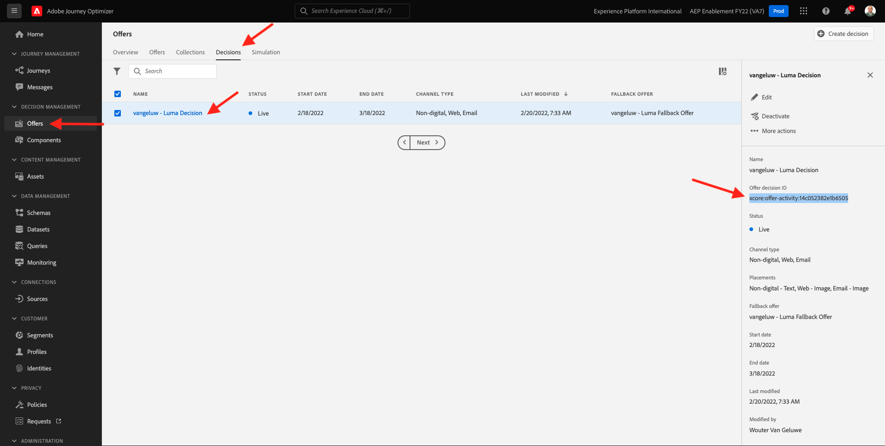

As you can see in the above image, in this example the [Decision ID] is `xcore:offer-activity:14c052382e1b6505`. Write down the [Decision ID] for your decision `--demoProfileLdap-- - Luma Decision` as you'll need it in the next exercise.

Now that you've retrieved the two elements you need to create a **[Decision Scopes]**, you can continue with the next step, which involves encoding the decision scope.

### 9.3.2.3 BASE64 Encoding

The **[Decision Scope]** you need to enter is a BASE64-encoded string. This BASE64-encoded string is a combination of the [Placement ID] and the [Decision ID], as you can see below. 

```json
{
  "activityId":"xcore:offer-activity:14c052382e1b6505",
  "placementId":"xcore:offer-placement:14bf09dc4190ebba"
}
```

The **[Decision Scope]** can be generated in two ways:

- Use a public service like [https://www.base64encode.org/](https://www.base64encode.org/). Enter the JSON code as mentioned above, click **[Encode]** and you'll get your BASE64 encoded string below.

  

- Retrieve the BASE64 encoded string from Adobe Experience Platform. Go to [Decisions] and click to open your [Decision], which is named `--demoProfileLdap-- - Luma Decision`.

  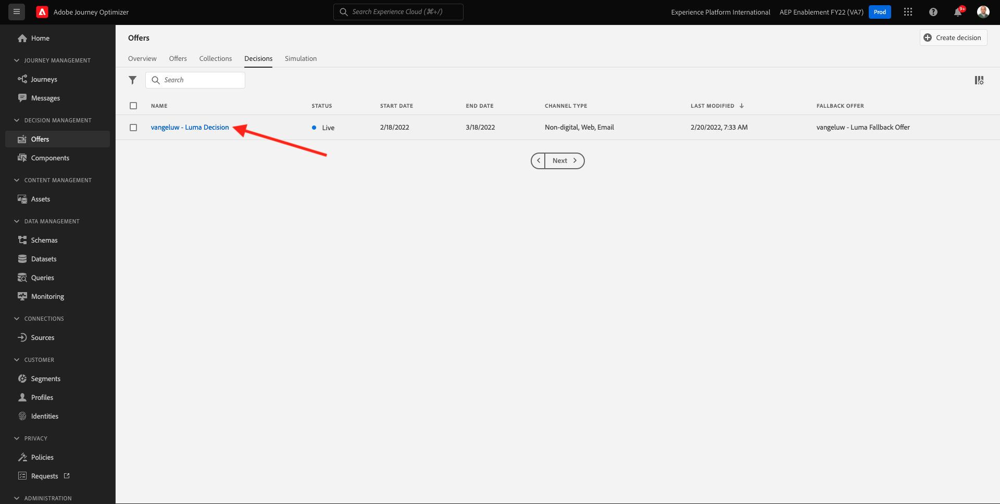
  
  After opening `--demoProfileLdap-- - Luma Decision`, you'll see this. Locate the placement [Web - Image] and click the **[Copy]** button. Next, click **[Encoded decision scope]**. The **[Decision Scope]** is now copied to your clipboard.
    
  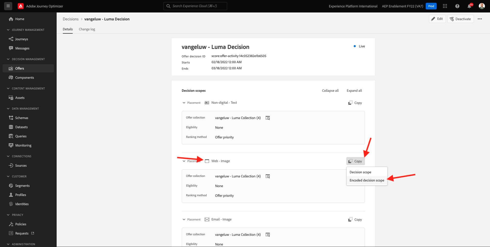

Next, go back to Launch, to your action **[AEP Web SDK - Send Event]**.


Paste your encoded decision scope in the input field.

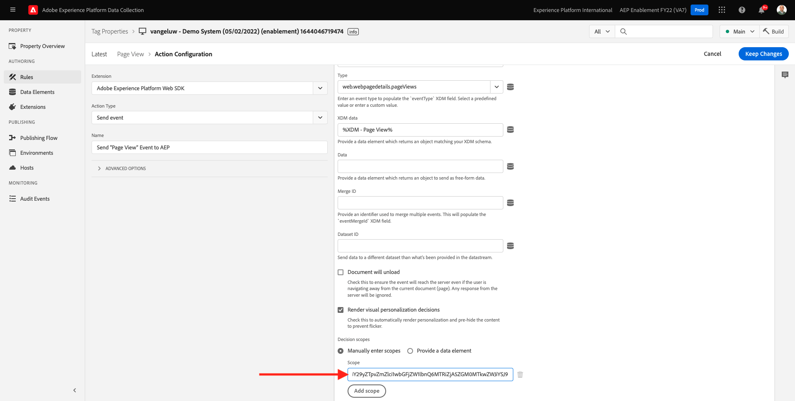

Save your changes in the action **[AEP Web SDK - Send Event]** by clicking **[Keep Changes]**. 

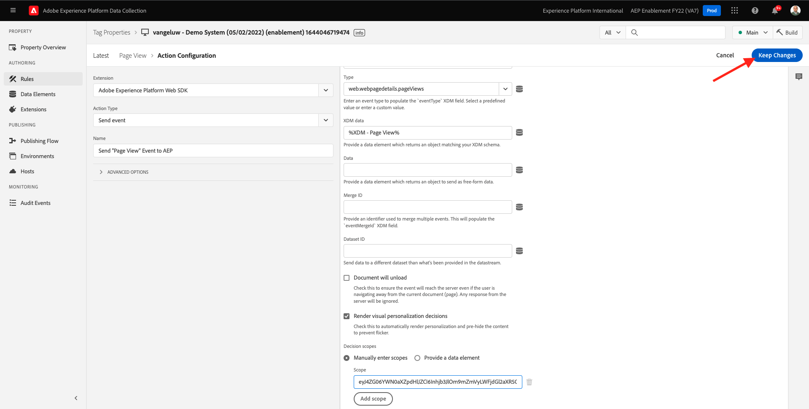

Next, click **[Save]** or **[Save to Library]**

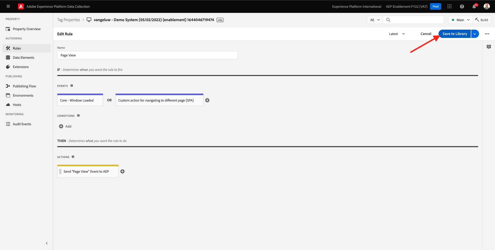

In Adobe Experience Platform Data Collection, go to **[Publishing Flow]** and open your **[Development Library]** which is named **[Main]**. Click **[+ Add All Changed Resources]** and then click **[Save & Build for Development]**. Your changes will now be published to your demo website.

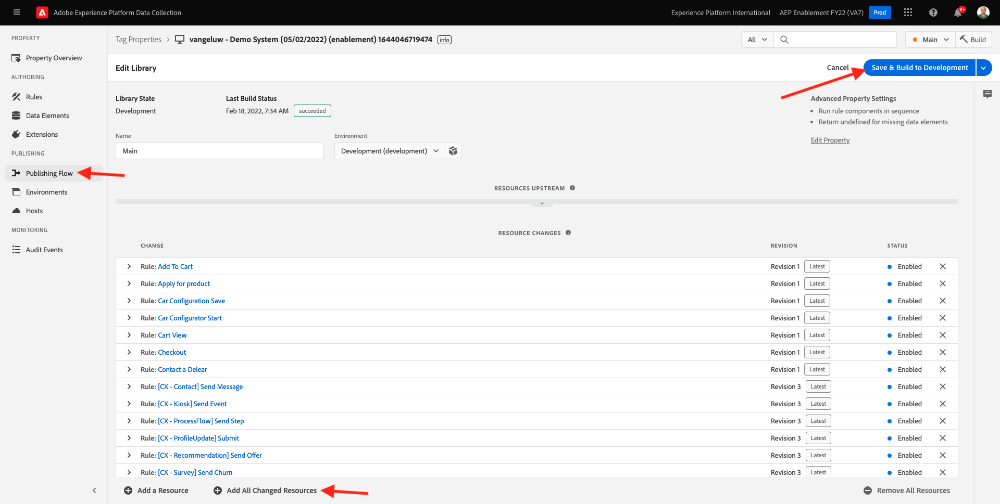

Every time you're loading a **General Page** now, like for instance the homepage of the demo website, Offer Decisioning will evaluate what the applicable offer is and will return a response back to the website with the details of the the offer to show. Showing the offer on the website requires additional configuration, which you'll do in the next step.

## 9.3.3 Configure your Adobe Experience Platform Data Collection Client property to receive and apply Personalized Offers

Go to [https://experience.adobe.com/#/data-collection/](https://experience.adobe.com/#/data-collection/), to **[Properties]**. Search for your Data Collection properties, which are named `--demoProfileLdap-- - Demo System (DD/MM/YYYY)`. Open your Data Collection property for web.


In you property, go to **[Rules]**.

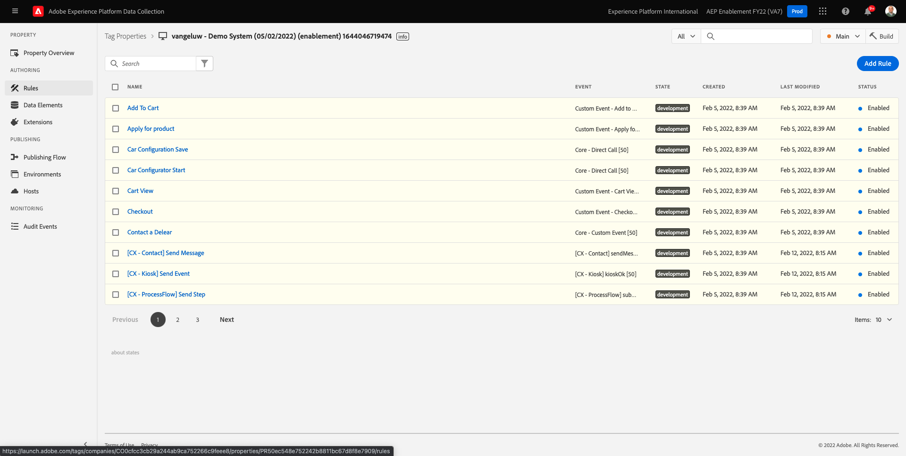

Search and open the rule **Decision Received**.

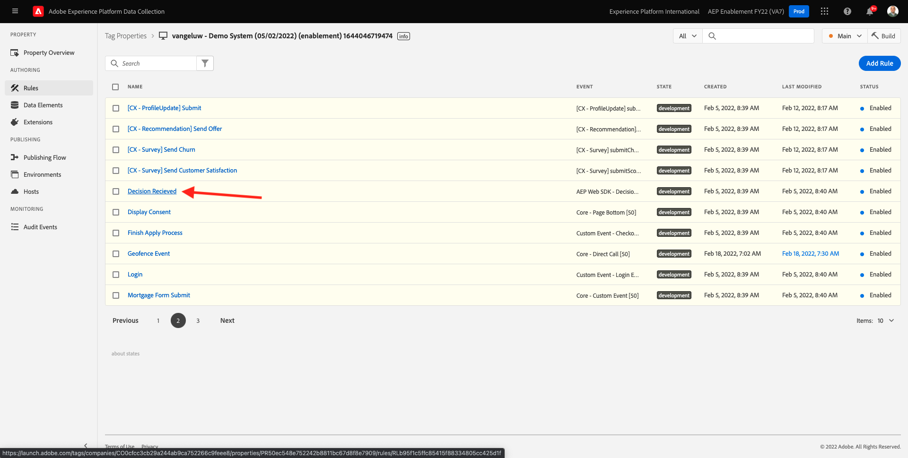

You'll then see this. Open the action **Place the offer on the page**.

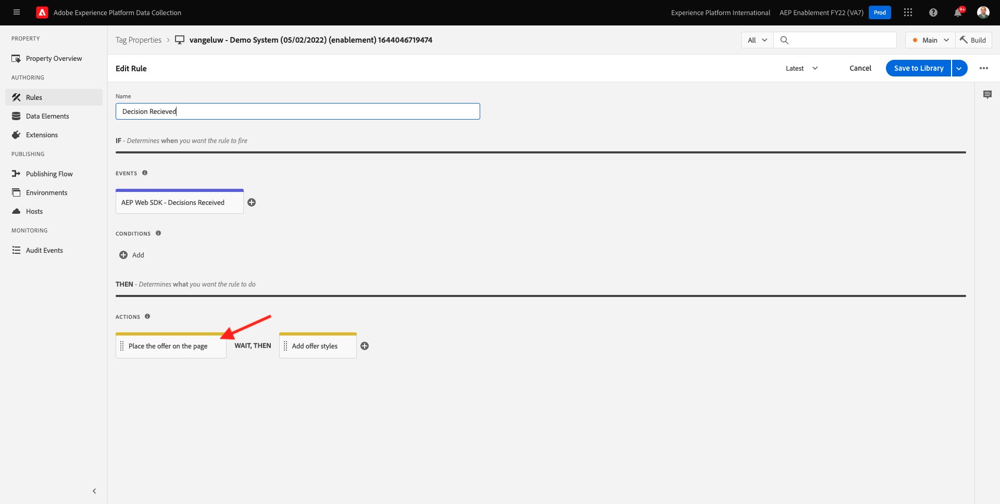

Click **[Open Editor]**

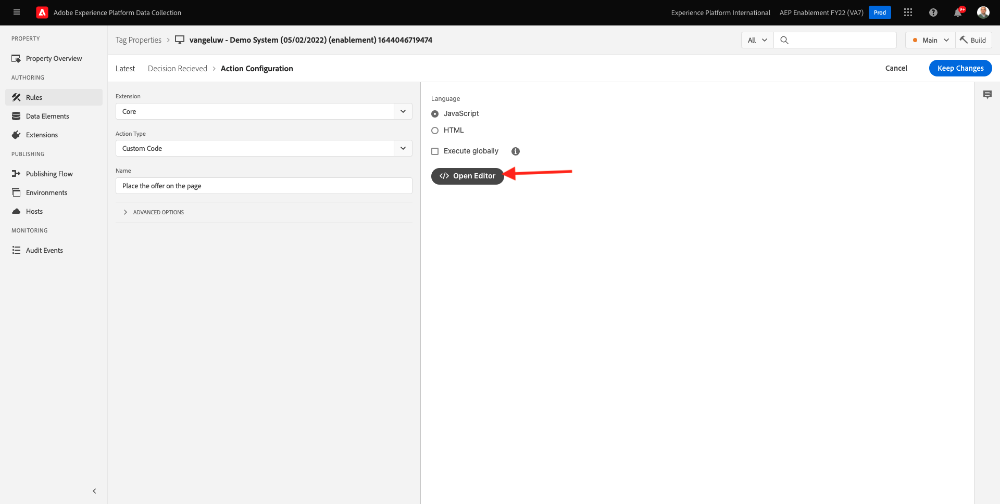

Overwrite the code by pasting the below code in the editor.

```javascript
if(!Array.isArray(event.decisions)) {
  console.log('No decisions returned')
  return;
}
console.log("decision",event.decisions)

event.decisions.forEach(function(payload) {
  payload.items.forEach(function(item){
    console.log("Response from Offer Decisioning ", item.data.content);
   
    var element = document.querySelector("#root > div > div > div.app-content > div > section.feature_part.padding_top > div > div.row.align-items-center.justify-content-between > div.col-lg-7.col-sm-6.\\30  > div");
    if(!element){
      console.log("Offer Placement Area Selector not found")
      return;
    }
    if(!item.data){
      return
    }
    //check if offer already exists
    var offer = document.querySelector("#root > div > div > div.app-content > div > section.feature_part.padding_top > div > div.row.align-items-center.justify-content-between > div.col-lg-7.col-sm-6.\\30  > div");
    if(!offer){ 
      element.insertAdjacentHTML('afterbegin', item.data.content) 
    }
    else { 
      console.log("item.data.deliveryURL: " + item.data.deliveryURL)
      document.querySelector("#root > div > div > div.app-content > div > section.feature_part.padding_top > div > div.row.align-items-center.justify-content-between > div.col-lg-7.col-sm-6.\\30  > div").style.background="url('"+item.data.deliveryURL+"')";
      document.querySelector("#root > div > div > div.app-content > div > section.feature_part.padding_top > div > div.row.align-items-center.justify-content-between > div.col-lg-7.col-sm-6.\\30  > div").style.backgroundRepeat="no-repeat";
      document.querySelector("#root > div > div > div.app-content > div > section.feature_part.padding_top > div > div.row.align-items-center.justify-content-between > div.col-lg-7.col-sm-6.\\30  > div").style.backgroundPosition="center center";
      document.querySelector("#root > div > div > div.app-content > div > section.feature_part.padding_top > div > div.row.align-items-center.justify-content-between > div.col-lg-7.col-sm-6.\\30  > div").style.backgroundSize = "contain";
    }  
  })
});
```

Lines 26-27-28-29 will apply the image that's being returned by Offer Decisioning to the website. Click **[Save]**.

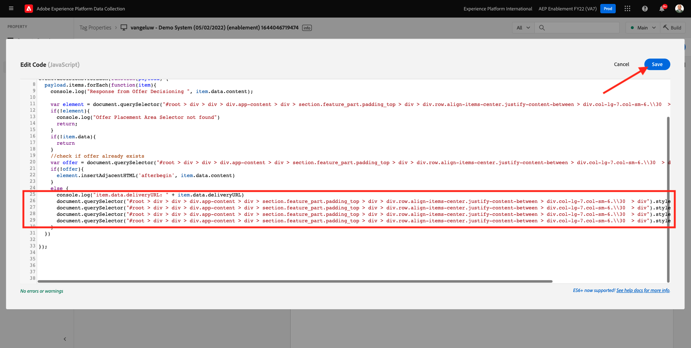

Click **[Keep Changes]**.

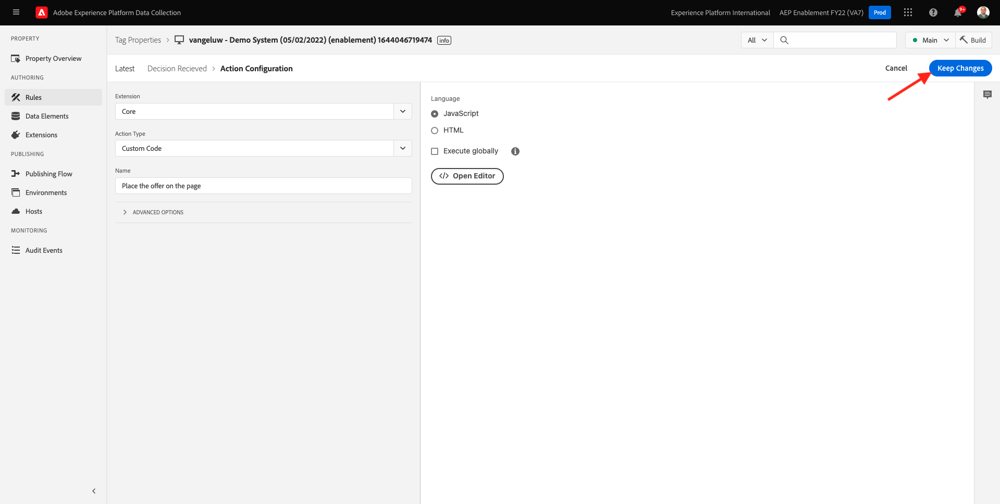

Next, click **[Save]** or **[Save to Library]**

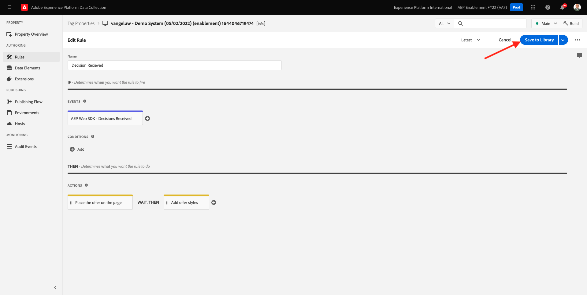

In Adobe Experience Platform Data Collection, go to **[Publishing Flow]** and open your **[Development Library]** which is named **[Main]**. Click **[+ Add All Changed Resources]** and then click **[Save & Build for Development]**. Your changes will now be published to your demo website.

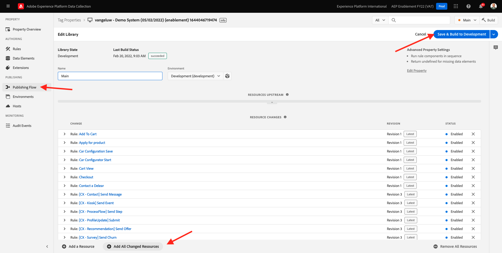

With this change, this rule in Adobe Experience Platform Data Collection will now be listening to the response from Offer Decisioning which is part of the Web SDK response, and when the response is received, the image of the offer will be displayed on the homepage.

Looking at the demo website, you'll see that this image will be replaced now:



As part of module 6, you already configured an Adobe Target Experience Targeting activity that will change the image of the hero location on the homepage, as you can see in the screenshot. For the sake of the exercise, you'll now make your offers appear on the image below the hero image as indicated in the screenshot. 



And instead of the default Luma website images, you will now see an offer like this one. In this case, the fallback offer is displayed.

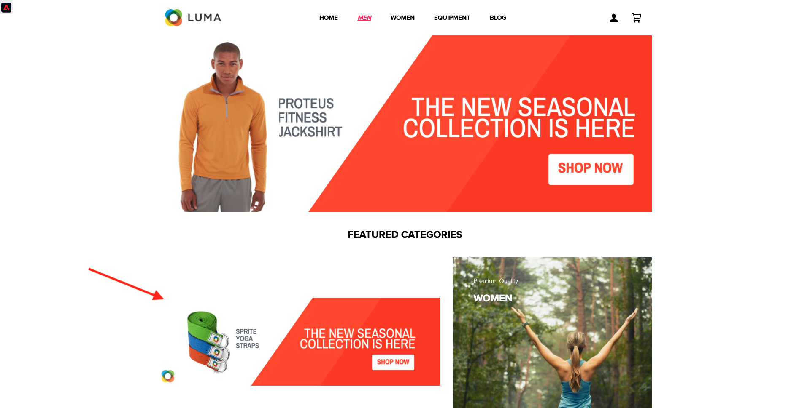

You've now configured 2 types of personalization:

- 1 Experience Targeting activity using Adobe Target in Module 6
- 1 Offer decisioning implementation using your Data Collection property

In the next exercise you'll see how you can combine your offers and decisions that were created in Adobe Journey Optimizer with an Adobe Target Experience Targeting activity.
